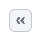

@import playground

@## Description

**Pagination** is a component with a group of controls for navigation through the long list of data.

### When to use

It is recommended to use pagination in tables, as well as in a long list of data which is comfortable to be looked page by page.

@## Component composition

**Pagination consists of:**

- [Buttons](/components/button/);
- [Input](/components/input/);
- [Link](/components/link/)
- [Text](/style/typography/).

@## Margins

- Margins between the buttons are always 8px.
- Margin between the different controls are 16px: between the buttons and the input for current page, between the input for current page and the select.

Margin from the table to the pagination is always 16px.

@## Number of the rows

We have some recommendations for the table size:

- Use minimum two user screens (± 2000 px) for the table.
- Show maximum 100 lines (if the lines are two-line, then 50 lines etc.).

@## Interaction

- The table should be scrolled up to the beginning when user moves between pages.
- After sorting and filtration pagination always returns user to the first page.

| Appearance                                         | Action                                                                                                                                            |
| -------------------------------------------------- | ------------------------------------------------------------------------------------------------------------------------------------------------- |
|   | Opens the first page                                                                                                                              |
|  | Opens the previous page                                                                                                                           |
|      | Opens the next page                                                                                                                               |
|               | When the input is in focus, the clickable `Return` icon with M size appears. By clicking it or pressing Enter the user moves to the entered page. |

The current page should be always displayed in the input:

- When the input is unfocused, show the current page, even if the user have changed this value, but did not press `Enter` or clicked the icon inside the input.
- If the input is empty (for example the user cleared it) or 0 is entered, then the user will move to the first page by clicking the icon or pressing `Enter`.
- Such input should have limitation for entering any symbols except for numerical ones.

The link at the end of the pagination shows the total number of pages. User moves to the last page by clicking it.

@## States and cases

### User is on the first page

The "First page" button and the "Prev" button are `disabled` in this case.

### User is on the last page

The "Next page" button gets the `disabled` state, and the link to the last page becomes plain text.

### User enters the value that is more than the number of the pages

Do not show the error in this case, just move the user to the last page.

### One page

Use this state only if there is some data and there might be more data.

> If there is no data or the filter is applied, then there should not be any pagination. The table should contain a message that there is no data.

### Page loading

Do not show pagination while loading.

@## Optional states

#### Select for choosing the number of rows

After user changes the value in the select, the page should be refreshed and the value of the table rows from the select should be applied.

Use only these values for the select: 10, 20, 50, 100.

### It is impossible to calculate the exact number of pages

In this case add the `tilde (≈)` to the number of pages, and change the link with the number of all pages to the plain text.

@page pagination-a11y
@page pagination-api
@page pagination-code
@page pagination-changelog
