@import playground

> ⚠️ This component has a major version, changes in the [migration guide](/internal/migration-guide).

@## Description

**Pills** is a component used for:

- switching of states (tabs/views/screens with uniform content);
- filtering data in lists/tables/graphs.

@## Sizes and paddings

|           | Paddings                                 |
| --------- | ---------------------------------------- |
| XL (42px) |  |
| L (32px)  | 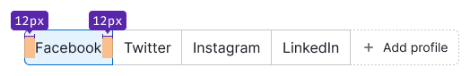   |
| M (26px)  | 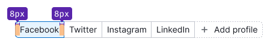   |

Optionally elements (icon/flag, status badge, counter) have the same indent as elements inside the [Button](/components/button/).

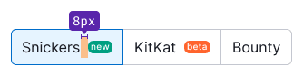
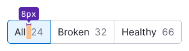

@## Types

### Main

It is used in most cases in our tools.

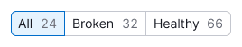

### Main pills 👑

In some tools, the pills can act as a block with shared metrics. Pills can be made "main" if they contain the target figures of the report. What is their difference from the usual pills:

- they are higher in height due to the content;
- they may have additional controls inside (usually adding/moving data by clicking on a link).

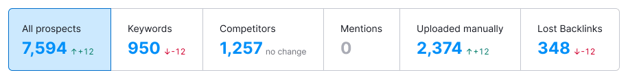

@## Interaction

### States

|                                        | Appearance                                   |
| -------------------------------------- | -------------------------------------------- |
| skeleton (initial loading of the page) | 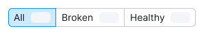       |
| normal, active                         |    |
| hover                                  | 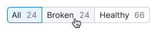            |
| disabled                               | 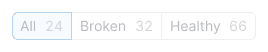      |
| disabled pill                          | 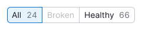 |
| loading                                | 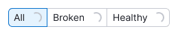        |

### The state for adding the pills

|        | Appearance                                       |
| ------ | ------------------------------------------------ |
| normal | 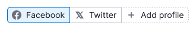 |
| hover  | 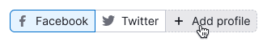     |
| active | 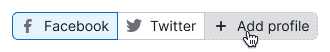    |

@## Use in UX/UI

Pills are used for:

- actions with data: filtering, sorting, navigation (displaying data chunks);
- changing the view/presentation of data.

Where do we use pills:

- lists;
- [таблицы](/table-group/table/);
- [графики](/data-display/chart-controls/);
- local filters in widgets, etc.

### Number of pills

Minimum in the component is 2, maximum – is unlimited. **But keep in mind that it will be difficult for the user to navigate the selection if there are too many items.** In this case, you can:

- collapse pills in [Select](/components/select/);
- collapse the last pills into a pill with an ellipsis.

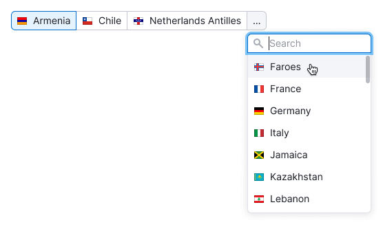

By clicking on the last pill with an ellipsis in the dropdown, it is possible to display a list of items that did not fit. The item selected from this list changes places with the penultimate item in the pill, and the penultimate item is added to the list in the sorting order.

### Erroneous use

You can't use buttons instead of pills:

You can't use pills instead of buttons:

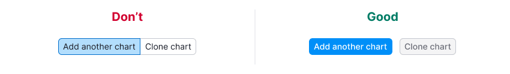

If words are too long, you can shorten them into abbreviations that users can understand:

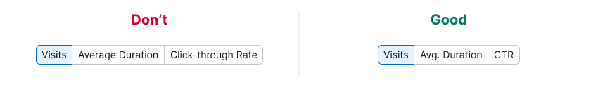

One item in the pills can't be used:

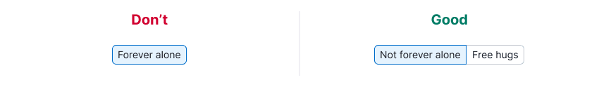

@page pills-api
@page pills-changelog
