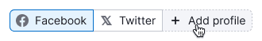
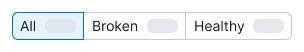
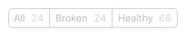
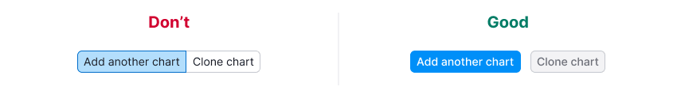

@import playground

@## Description

**Pills** is a component designed for:

- Switching between states, such as tabs, views, or screens with uniform content.
- Filtering data in lists, tables, and charts.

@## Component composition

Pills component consists of:

1. `Pill.Item`
2. `Pill.Item.Addon`
3. `Pill.Item.Text`

@## Sizes and margins

@table-caption Pills sizes and margins

| Size (height in px) | Margins                          |
| ------------------- | -------------------------------- |
| M (28px)            |  |
| L (40px)            |  |

Addons (icons, flags, badges, counters) have the same margin as the addons inside the [Button](/components/button/).

@## Cases

### Default

The default appearance used in most cases across our design system.

### Adding new item

> This type exists only in design, and the component doesn't cover this case yet.

@table-caption States for adding new item case in Pills

| State  | Appearance                          |
| ------ | ----------------------------------- |
| Normal |     |
| Hover  |      |
| Active |     |

### Pills as summary

In some products, pills can act as a block with shared metrics. Their differences from the default pills are:

- Increased height due to content.
- Additional controls inside, usually for adding/moving data by clicking on a link.

@## Interaction

@table-caption States for Pills

| State                                  | Appearance example             |
| -------------------------------------- | ------------------------------ |
| Skeleton (initial loading of the page) |  |
| Normal/Active                          |   |
| Hover                                  |           |
| Disabled                               |        |
| Disabled `Pills.Item`                  |   |
| Loading                                |         |

@## Usage in UX/UI

Pills are used for:

- Actions with data: filtering, sorting, navigation (displaying data chunks).
- Changing the view/presentation of data.

Pills can be used in:

- Lists;
- [Tables](/table-group/table/);
- [Charts](/data-display/chart-controls/);
- Local filters in widgets, etc.

### Number of pills

The minimum number of pills in the component is 2, and the maximum is unlimited. However, keep in mind that it might be challenging for the user to navigate the selection with too many items. In such cases, you can:

- Collapse pills into a [DropdownMenu](/components/dropdown-menu/) with an `Ellipsis` icon;
- Use [Select](/components/select) instead.

Clicking on the last pill with an ellipsis in the dropdown displays a list of items that did not fit. The selected item from this list will be placed before the pill with an ellipsis.

### Examples of wrong usage

Don’t use buttons instead of pills:

Don’t use pills instead of buttons:

If words are too long, you can shorten them into abbreviations that users can understand:

Don’t use a single `Pills.Item`:

@page pills-a11y
@page pills-api
@page pills-code
@page pills-changelog
