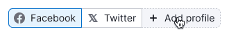

@import playground

@## Description

**Pills** is a component used for:

- switching of states (tabs/views/screens with uniform content);
- filtering data in lists/tables/graphs.

@## Sizes and paddings

| Size (height in px) | Paddings                               |
| ------------------- | -------------------------------------- |
| L (40px)            |  |
| M (28px)            |  |

Addons (icon, flag, badge, counter) have the same padding as the addons inside the [Button](/components/button/).

@## Types

### Default pills

It is used in most cases in our products.

### Advanced pills (king-size 👑)

In some products, the pills can act as a block with shared metrics. Pills can be made "main" if they contain the target figures of the report. What is their difference from the usual pills:

- they are higher in height due to the content;
- they may have additional controls inside (usually adding/moving data by clicking on a link).

### Pill for adding new item

Note that this type is design-only yet.

| State  | Appearance                                       |
| ------ | ------------------------------------------------ |
| Normal |  |
| Hover  |      |
| Active |     |

@## Interaction

| State                                  | Appearance                                   |
| -------------------------------------- | -------------------------------------------- |
| Skeleton (initial loading of the page) |  |
| Normal, active                         |    |
| Hover                                  |             |
| Disabled                               |       |
| Disabled pill                          |  |
| Loading                                |         |

@## Usage in UX/UI

Pills are used for:

- actions with data: filtering, sorting, navigation (displaying data chunks);
- changing the view/presentation of data.

Use pills in:

- lists;
- [tables](/table-group/table/);
- [charts](/data-display/chart-controls/);
- local filters in widgets, etc.

### Number of pills

Minimum in the component is 2, maximum – is unlimited. **But keep in mind that it will be difficult for the user to navigate the selection if there are too many items.** In this case, you can:

- collapse pills in [DropdownMenu](/components/dropdown-menu/);
- collapse the last pills into a pill with an ellipsis.

By clicking on the last pill with an ellipsis in the dropdown, it is possible to display a list of items that did not fit. The item selected from this list put before pill with ellipsis.

### Examples of wrong use

Do not use buttons instead of pills:

Do not use pills instead of buttons:

If words are too long, you can shorten them into abbreviations that users can understand:

Do not use one Pills.Item:

@page pills-a11y
@page pills-api
@page pills-code
@page pills-changelog
