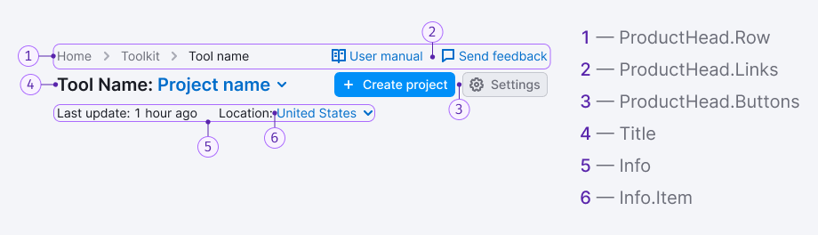
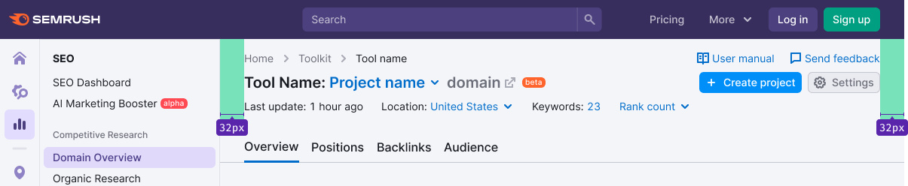
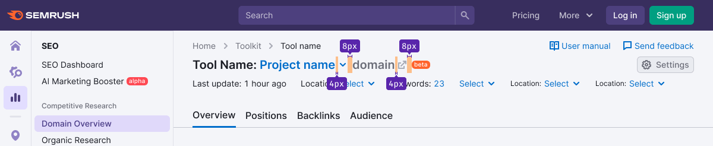
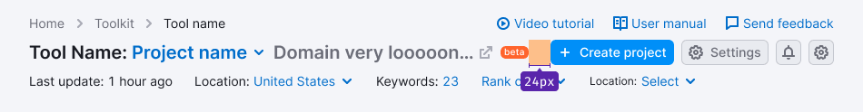
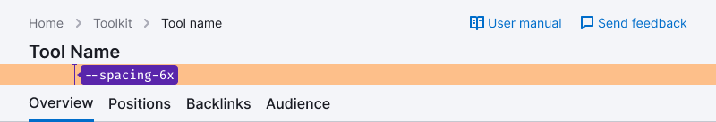
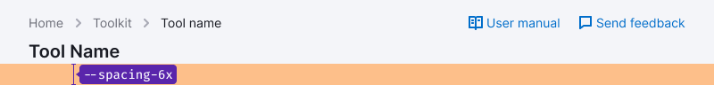

## Description

**ProductHead** is a comprehensive composed component that contains all common controls, CTAs, and filters for data filtering in the product's reports.

It's always positioned below the main Semrush header and searchbar.

## Component composition

**The report header includes the following:**

1. `ProductHead.Row`: The header is divided into rows with components, and they're separated from each other by equal margins.
2. `ProductHead.Links`: They're usually placed at the top right of the header, refer to [Additional links pattern](/patterns/links-order/links-order).
3. `ProductHead.Buttons`.
4. `Title`: It's a name of the product and the project. Can have additional controls for customizing the product or performing additional actions.
5. `Info`: It's a row with global filters and/or additional information.
6. `Info.Item`: An item with the information on the project or global filter.

## Appearance

### Marings and paddings

Set left and right paddings to `--spacing-8x`.

### Margins between elements

### Styles

#### Breadcrumbs and additional links

::: tip
Use the [ButtonLink](../../components/button/button#button-with-link-styles) component if the element acts as a button: that is, opens a dialog or changes something on the page.
:::

- [Breadcrumbs](/components/breadcrumbs/breadcrumbs) and [additional links](/patterns/links-order/links-order) are center-aligned.
- [Links](/components/link/link) have a size of 14px.

#### Heading and main controls

- The heading, buttons, and labels are center-aligned with respect to each other.
- For the title, use text with a size of 20px (use `--fs-400`, `--lh-400` tokens).
- Use `--text-primary` token for the text color, and for the project's name, use `--text-secondary` token.
- The size of nearby icons should be M. For icon color, use the `--icon-secondary-neutral` token.
- The icons are aligned with the title's baseline.
- [Button](/components/button/button) has a size of M.

#### Filters and/or additional information

- All elements are center-aligned.
- For text, use a size of 14px (use `--fs-200`, `--lh-200` tokens) and `--text-primary` token for the color.
- Icons have a size of M.

## Component variants

### Maximum set of elements inside

When the domain and/or project names are too long and don't fit in the intended place, clip them with an `ellipsis`. If you have controls on the right, add a margin of `--spacing-6x`.

### No global filters, additional information or tabs

Even if your `ProductHead` doesn't have the row with filters and data, it should still have a bottom margin of `--spacing-6x`.

