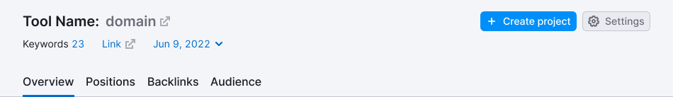

@## Description

**ProductHead** is a composed component, where all the components of the report header, as well as the global filters for filtering data in the report, are collected.

The report header is always placed under the global heading Semrush and Searchbar (if any).

@## Components consists of

### The report header includes the following

- [breadcrumbs](/components/breadcrumbs/);
- [additional links](/patterns/links-order), placed at the top right of the header;
- name of the tool and the project;
- additional controls customizing the tool or making any additional actions (placed at - the right on the level of the tool name);
- line with global filters and/or additional information.

@## Sizes

@## Margins

If there is [Notice](/components/notice/) in the header, its margins to the heading elements are 8px (`my={2}`).

@## Margins between the header blocks

Margins from the left and the right edge - 30px.

@## Margins between the header elements

### Line with the breadcrumbs and additional links

- The [breadcrumbs](/components/breadcrumbs/) and the links are aligned center.
- [M size links](/components/link/).
- The distance between the links — 20 px (`mr={5}`).

### Line with the headings and controls

- The heading, buttons and labels are aligned center with regard to each other.
- [The size of the heading is always h3](/style/typography/).
- The main text colour - `var(--gray20)`, projects – `var(--gray60)`.
- The size of the nearby icons — M. The icon’s colour corresponds to the element near it.
- The icons are aligned by the heading’s basic line.
- The [buttons’ size is M](/components/button/), the colour is determined by the control’s purpose.

### Line with filters and/or additional information

- The line with additional information is centered.
- Block height — 18px.
- `font-size: var(--fs-100); line-height 18px;`.
- The used icons size — XS.
- The dividers height is 18px, the colour is `var(--gray80)`.
- The dividers’ paddings — 12px (`mx={3}`) at the right and at the left.

@## Report header variants

### Maximum possible set of components inside

> 💡 When the names of the domain and/or project are very long and do not fit the space of the screen, they are put into `ellipsis`. If there are controls at the right, they must have a “protective” left padding of 24px (`ml={6}`) in order the text did not stick together with the controls.

### Small global filters/additional information

### No global filters/additional information/tabs

In these cases the padding between the block with the heading and the buttons and the tabs/divider – 16px (`mb={4}`).

@page product-head-api
@page product-head-code
@page product-head-changelog
