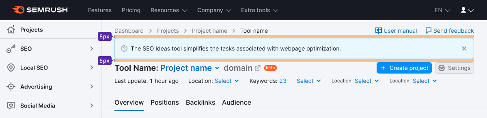
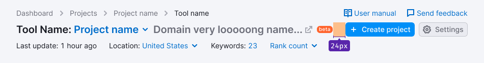
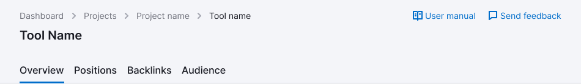

@## Description

**ProductHead** is a composed component, which contains all common controls, CTA's and filters for filtering data in the product's reports.

It's always placed under the main Semrush header and searchbar.

@## Component composition

**The report header includes the following:**

- [breadcrumbs](/components/breadcrumbs/);
- [additional links](/patterns/links-order), placed at the top right of the header;
- name of the product and the project;
- additional controls customizing the product or making any additional actions (placed at - the right on the level of the product name);
- line with global filters and/or additional information.

@## Margins and paddings

If there is a [Notice](/components/notice/) in the header, it has 8px margin-bottom to the elements in ProductHead.

### Margins between the elements

@## Styles

### Breadcrumbs and additional links

- [Breadcrumbs](/components/breadcrumbs/) and additional links are center aligned.
- [Links](/components/link/) have 14px size.
- The margin between the links is 20 px.

### Heading and main controls

- Heading, buttons and labels are center aligned regard to each other.
- For title use text with 20px size (`--fs-400; --lh-400`).
- For the text color use `var(--gray-800)`, for project's name – `var(--gray-500)`.
- The size of the nearby icons — M. Color icon into `var(--gray-300)`.
- The icons are aligned by the title's basic line.
- [Button](/components/button/) has M size.

### Filters and/or additional information

- All elements are center aligned.
- For text use 14px size (`--fs-200; --lh-200`) and `var(--gray-800)` color.
- Icons have M size.

@## ProductHead variants

### Maximum set of elements inside

> When the names of the domain and/or project are too long and don't fit in the intended place, collapse them into `ellipsis`. If you have controls on the right, add them a “protective” left margin of 24px.

### Global filters or additional information

### No global filters, additional information or tabs

In these cases the margin between the row with product's title and the TabLine/Divider is 16px.

@page product-head-a11y
@page product-head-api
@page product-head-code
@page product-head-changelog
