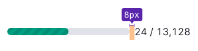
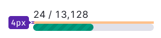
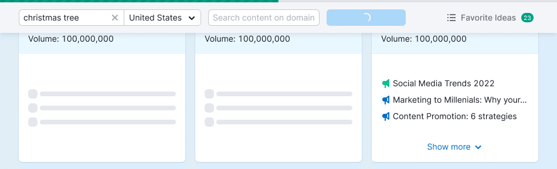

@import playground

@## Description

**ProgressBar** is a component used to display a long process, usually more than 5 seconds. _For example, collecting keywords or updating mentions._

As a rule, the progress bar does not block working with the tool. The exception is the first launch of the tool when the data is partially displayed or not displayed at all.

> 💡 This component is one of the components that displays the loading and response to user actions in the interface. For General rules for such components, see [Loading patterns](/patterns/loading-states/).

@## Appearance

### Components consists of

The progress bar consists from (surprise!):

- Bar
- Progress

### Sizes

In our interface, the progress bar is available in the following three sizes.

| Size | Appearance             | Styles                              | Example of use                                                                                                                                                               |
| ---- | ---------------------- | ----------------------------------- | ---------------------------------------------------------------------------------------------------------------------------------------------------------------------------- |
| L    |  | `height: 12px; border-radius: 6px;` | In modal windows, on the start screen when launching the tool.                                                                                                               |
| M    |  | `height: 8px; border-radius: 4px;`  | Inside the product.                                                                                                                                                          |
| S    |  | `height: 4px; border-radius: 2px;`  | In widgets inside reports/tools. When they replace the button (for example, restart audit). When uploading multiple files, when you need to display the status of each file. |

### Themes and styles

The progress bar has two themes to use: light and dark background. Both themes use the `$green` color with a pattern to display progress.

| Theme  | Appearance                 | Styles                                |
| ------ | -------------------------- | ------------------------------------- |
| invert |      | `background: rgba(100,120,126,0.15);` |
| dark   |  | `background: rgba(255,255,255,0.2);`  |

@## Interaction

### States

The progress bar has three states:

- 0% – the progress bar is gray with animation.

- 11-99% – the progress bar is partially filled and the pattern is animated.

- 100% – the progress bar is static, green.

The progress bar shall not remain in the 100% state – once the process is completed, either a message about the success of the process shall be displayed, or you should offer the user further actions.

> 💡 If it is not possible to perform the action immediately, the success status shall be displayed and the user shall be told what to do next. For example, it is possible to use a dropdown with some text and CTA in this case.

There may be displayed a counter next to the progress bar to show how many of the files were loaded. If there is no data on the exact number of files, then nothing should be displayed, including percentages.

Depending on the usage context, the counter may be above or near the progress bar.

**The margins between the counter and the progress bar shall be a multiple of 4**.

### Animation

Progress to a value is always animated with `ease-in`.

@## Use in UX/UI

### When and why it should be used

- If you need to visualize a long process and it doesn't block working with data.
- When you need to visualize a short process, but it is important to show how much is left until the end of the process. _For example, uploading multiple files._
- If the process is long and blocks working with data, but it is necessary to let the user know when this process will end.

> 💡 Sometimes you can use an animation without the green bar instead of the progress bar when launching the tool. This can be done when you don't know how long the collection will take. Or in this case, you can make a fake progress bar which will create the illusion of the user approaching the end of the process.

#### Don't use it

- if you need to show some short action (no more than 5 seconds), it is better to use [Spin](/components/spin/);
- to display steps (for example, when filling out a form).

### Operation algorithm and time

- If the download process is too long and we know about it in advance, the progress shall be visualized immediately.
- If the exact or approximate loading time is not known, wait for 3 seconds and display the fake progress.
- In cases when loading is very fast, set the minimum time for displaying the progress bar – 3 seconds. This is necessary to avoid "blinking" by the progress bar and the interface.

### Fixed progress bar

When scrolling, the progress bar can be fixed at the upper margin. In this case, it is fixed above all components, including filters, table headers, etc.

> 💡 This component is one of the components that displays the loading and response to user actions in the interface. For General rules for such components, see [Loading patterns](/patterns/loading-states/).

@page progress-bar-api
@page progress-bar-code
@page progress-bar-changelog
