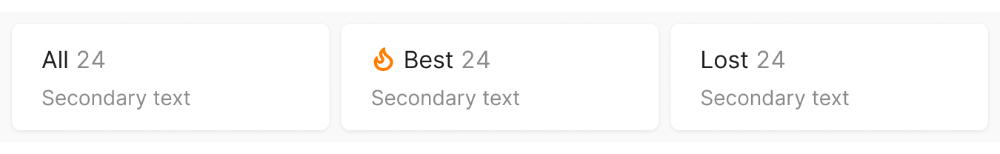

<Playground for="RadioCards" />

## Description

**RadioCards** is a component designed for:

- switching between predefined sets of filter values in reports
- switching between different reports and report views

## Component composition

{style="float: right; max-width: 65%"}

1. RadioCards
1. RadioCards.Item
2. `text`
3. `textAddon` (optional)
4. `iconAddon` (optional)
5. `description` (optional)

## Appearance

RadioCards have two options of addon size and position:

1. A small icon before the title — to highlight one item.

2. A larger icon, illustration, or mini chart addon in the left part of the item — to illustrate and distinguish the items ([live example](./radio-cards-code#custom-layout-with-large-addon)).

## Interaction

RadioCards behave like [Radio](../radio/radio): user can select only one at a time.

It's not mandatory for one item to be selected by default on page load. You can select one or leave all items unselected, depending on your case.

### States

Table: RadioCards item states

| State           | Illustration                                 | Note                                                                                                                          |
| --------------- | -------------------------------------------- | ----------------------------------------------------------------------------------------------------------------------------- |
| Normal          |            |                                                                                                                               |
| Hover           |              |                                                                                                                               |
| Selected        |        |                                                                                                                               |
| Initial loading |  | 
Use this state only if there's asynchronously loaded data in the item, such as a counter.
 |
| Disabled        |        |                                                                                                                               |

## Use in UX/UI

If your RadioCards have 4 or more items, stretch them to the full page width.

If your RadioCards have 3 or less items, set a fixed width limit for the whole group. This makes it easier for the user to compare and interact with the items.

