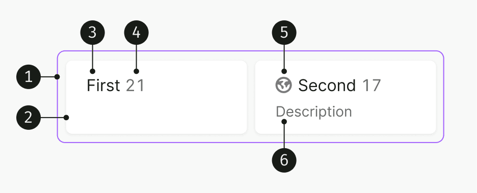
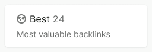
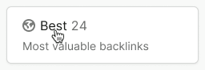
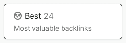
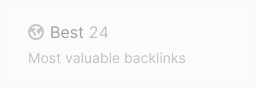
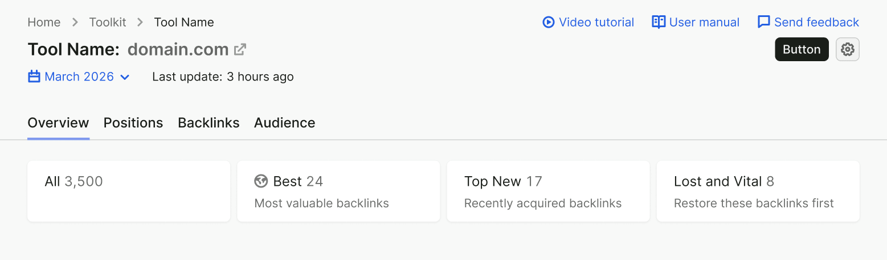
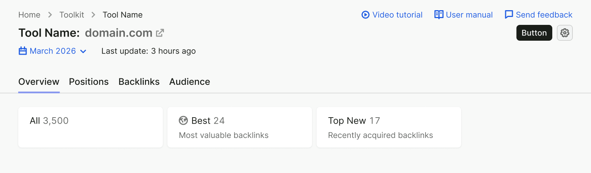

<Playground for="RadioCards" />

## Description

**RadioCards** is a component designed for:

- Switching between filter presets in reports, that is, predefined values of Pills, FilterTrigger, and other filters.
- Switching between different report views.

## Component composition

{style="float: right; max-width: 65%"}

1. RadioCards
1. RadioCards.Item
2. `text`
3. `textAddon` (optional)
4. `iconAddon` (optional)
5. `description` (optional)

## Interaction

RadioCards behave like [Radio](../radio/radio): user can select only one at a time.

You can either set a default selected item on page load, or not select any item, depending on your case.

### States

Table: RadioCards item states

| State           | Illustration                                 | Note                                                                                                                          |
| --------------- | -------------------------------------------- | ----------------------------------------------------------------------------------------------------------------------------- |
| Normal          |            |                                                                                                                               |
| Hover           |              |                                                                                                                               |
| Selected        |        |                                                                                                                               |
| Initial loading |  | 
Use this state only if there's asynchronously loaded data in the item, such as a counter.
 |
| Disabled        |        |                                                                                                                               |

## Use in UX/UI

If your RadioCards have 4 or more items, stretch them to full page width.

If your RadioCards have 3 or less items, we recommend setting a fixed width limit for the whole group. This makes it easier for the user to compare and interact with the items.

