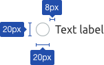
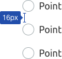
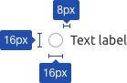
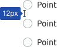

@import playground

@## Description

**Radio button** is a control for selecting one of several values/options.

The radio button clearly displays the user's selection status. It is used mainly for group settings when there is a list of parameters/options/etc., and the user can choose only one option.

@## Appearance

### Dimensions and indents

Our interface uses 3 control's sizes — Xl, L, and M. The text label is placed to the right of the radio button.

Try to indent the radio buttons so that the options are easy to read. The indents may vary depending on the context of use. But it is advisable to make them multiples of 4. Recommended ones are listed below.

| Size   | Appearance                        | Magin                                |
| ------ | --------------------------------- | ------------------------------------ |
| **XL** |  |  |
| **L**  |   |   |
| **M**  |   |   |

### Radio button with a paragraph

All sizes of radio buttons can be used with the corresponding text paragraphs.

| Size   | Appearance                                                 |
| ------ | ---------------------------------------------------------- |
| **XL** |  |
| **L**  |   |
| **M**  |   |

@## Interaction

The radio button is turned on/off by clicking on the entire area of the component, text label, or related words.

A text label may contain a link or pseudo-link. In this case, the radio button is turned on/off by clicking on the entire area of the text label except the link area. A link in a text label opens the URL in a new window.

If the radio button is `disabled`, the text label and related words must also have the `disabled` state.

### States

|           | Appearance                                        |
| --------- | ------------------------------------------------- |
| unchecked |  |
| checked   |    |
| disabled  |    |
| invalid   |   |

@## Use in UX/UI

- **Build lists of options vertically with left alignment, one option per line.** If you have to use a horizontal layout, make sure the indents between elements are correct.
- **Use positive wording for labels** to make it clear what happens if the user selects a specific radio button.
- Use radio buttons only for binary settings (when you need to select one of them).
- Specify in the prototype or technical documentation what happens to the radio button after refreshing the page: reset or save.
- This control is most often used in lists of settings. In filters, we recommend using the [Pills](/components/pills/) component instead of radio buttons.

@page radio-api
@page radio-code
@page radio-changelog
