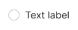
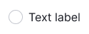
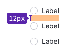
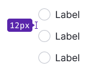
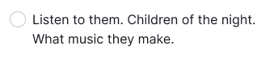
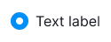
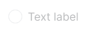

@import playground

@## Description

**Radio button** is a control for selecting one of several values/options.

The radio button shows the user's selection status. It is used mainly for group settings when there is a list of parameters/options/etc., and the user can choose only one option.

@## Sizes and indents

Our radio button has two sizes: M and L. The text is always placed to the right of the radio button.

Try to indent the radio buttons so that the options are easy to read. The indents may vary depending on the context of use. But it is advisable to make them multiples of 4. Recommended ones are listed below.

| Size (px)        | Appearance example      |
| ---------------- | ----------------------- |
| M (16px \* 16px) |  |
| L (20px \* 20px) |  |

### Margins

Margins between the options may vary depending on the usage context. Make margins multiples of 4. Default recommended margins are shown below.

| Size (px)        | Appearance example      |
| ---------------- | ----------------------- |
| M (16px \* 16px) |  |
| L (20px \* 20px) |  |

@## Radio button with a paragraph

All checkbox sizes can be used with the corresponding text paragraphs.

| Radio button size (px) | Paragraph size                            | Appearance example (px)                             |
| ---------------------- | ----------------------------------------- | --------------------------------------------------- |
| M (16px \* 16px)       | 14px (use variables `--fs-200, --lh-200`) |  |
| L (20px \* 20px)       | 16px (use variables `--fs-300, --lh-300`) |  |

@## Interaction

- When user hovers over the "Radio + text" area, the cursor changes to pointer.
- The radio button changes its state by clicking on the entire area of the component that includes radio button and text.
- The radio button text may contain a link or pseudo-link. In this case, the radio button changes its state by clicking on the entire text area, except for the link area.
- If the radio button is disabled, the text and related words shall also be `disabled`. In such cases, we recommended you to place a tooltip with an explanation of why the radio button is disabled.

### States

|           | Appearance                                               |
| --------- | -------------------------------------------------------- |
| unchecked |  |
| checked   |    |
| disabled  |  |
| invalid   |    |

@## Use in UX/UI

- **Make lists of options vertically and left aligned**, one option per line. If you have to use a horizontal layout, make sure that margins between the options are enough to distinguish them.
- **Use positive wording for labels** to make it clear what happens if the user enables a radio button.
- Use radio buttons only for binary settings (when you need to select one of them).
- This control is most often used in lists of settings. In filters, we recommend using the [Pills](/components/pills/) component instead of radio buttons.

@page radio-a11y
@page radio-api
@page radio-code
@page radio-changelog
