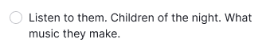
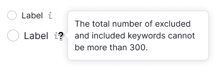
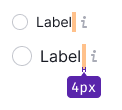

::: react-view

:::

## Description

**Radio button** is a control for selecting one of several values or options.

The radio button indicates the user's selection status and is primarily used for group settings with a list of options, where only one can be selected.

## Component composition

Component consists of the following:

1. `RadioGroup`
2. `Radio`
3. `Radio.Value`
4. `Radio.Text`

## Sizes and margins

The radio button has two sizes: M and L. The text label is always positioned to the right of the radio button.

Table: Radio button sizes

| Size (px)       | Appearance example     |
| --------------- | ---------------------- |
| M (16px x 16px) |  |
| L (20px x 20px) |  |

### Margins

The spacing between options may differ based on the context in which they are used. To maintain consistency, it's recommended to use margins that are multiples of 4. The default margins are displayed below.

Table: Radio button margins

| Size (px)       | Margins                                          |
| --------------- | ------------------------------------------------ |
| M (16px x 16px) |   |
| L (20px x 20px) |   |

## Radio button with a paragraph

All radio button sizes can be used with the corresponding text paragraphs.

Table: Radio button with a paragraph of text

| Radio button size (px) | Paragraph size (px)                      | Appearance example          |
| ---------------------- | ---------------------------------------- | --------------------------- |
| M (16px x 16px)        | 14px (use `--fs-200`, `--lh-200` tokens) |  |
| L (20px x 20px)        | 16px (use `--fs-300`, `--lh-300` tokens) |  |

## Radio button with Info icon

Add an `Info` icon next to the radio button label to provide more information about radio button's purpose. User can hover over the icon to see a tooltip with additional details.

::: tip
Info icon should have `margin-left: 4px`.
:::

## Radio button with a link inside

Text label may contain a [Link](/components/link/link).

::: tip
Note, that the radio button text active zone shouldn't include a link.
:::

## Interaction

- Hovering over the "Radio button and text" area changes the cursor to a pointer.
- Clicking anywhere on the "Radio button and text" area changes the state of the radio button.
- If the text label contains a link or pseudo-link, clicking on the link area doesn't change the radio button state.
- When the radio button is disabled, the text and related words should also be "disabled." It's recommended to include a tooltip explaining why the radio button is disabled.

### States

Table: Radio button states

| State    | Appearance                           |
| -------- | ------------------------------------ |
| Normal   |   |
| Checked  |   |
| Invalid  |   |
| Disabled |  |

## Usage in UX/UI

- **Make lists of options vertically and left aligned**, one option per line. If using a horizontal layout, ensure that there is enough space between options to differentiate them.
- **Use positive language for radio button labels** to clarify the action taken when the radio button is enabled.
- Use radio buttons only for binary settings (when you need to select one of them).
- This control is most often used in lists of settings. In filters, we recommend using the [Pills](/components/pills/pills) component instead of radio buttons.
