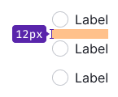
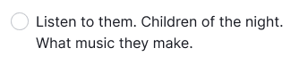
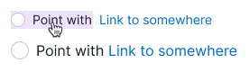

@import playground

@## Description

**Radio button** is a control for selecting one of several values or options.

The radio button indicates the user's selection status and is primarily used for group settings with a list of options, where only one can be selected.

@## Sizes and margins

Our radio button has two sizes: M and L. The text label is always positioned to the right of the radiobutton.

| Size (px)        | Appearance example      |
| ---------------- | ----------------------- |
| M (16px * 16px) |  |
| L (20px * 20px) |  |

### Margins

The spacing between options may differ based on the context in which they are used. To maintain consistency, it's recommended to use margins that are multiples of 4. The default margins are displayed below.

| Size (px)        | Margins      |
| ---------------- | ----------------------- |
| M (16px * 16px) |   |
| L (20px * 20px) |   |

@## Radiobutton with a paragraph

All radiobutton sizes can be used with the corresponding text paragraphs.

| Radio button size (px) | Paragraph size (px)                        | Appearance example                             |
| ---------------------- | -------------------------------------- | --------------------------------------------------- |
| M (16px * 16px)       | 14px (use `--fs-200, --lh-200` tokens) |  |
| L (20px * 20px)       | 16px (use `--fs-300, --lh-300` tokens) |  |

@## Radiobutton with Info icon

Add an `Info` icon next to the radiobutton label to provide more information about radiobutton's purpose. User can hover over the icon to see a tooltip with additional details.

> Info icon should have `margin-left: 4px`.

@## Radiobutton with a link inside

Text label may contain a [Link](/components/link).

> Note, that the radiobutton text hover zone shouldn't include a link.

@## Interaction

- Hovering over the "Radiobutton and text" area changes the cursor to a pointer.
- Clicking anywhere on the "Radiobutton and text" area changes the state of the radiobutton.
- If the text label contains a link or pseudo-link, clicking on the link area doesn't change the radiobutton state.
- When the radiobutton is disabled, the text and related words should also be "disabled." It's recommended to include a tooltip explaining why the radiobutton is disabled.

### States

|           | Appearance                                               |
| --------- | -------------------------------------------------------- |
| unchecked |  |
| checked   |    |
| Disabled  |  |
| Invalid   |    |

@## Use in UX/UI

- **Make lists of options vertically and left aligned**, one option per line. If using a horizontal layout, ensure that there is enough space between options to differentiate them.
- **Use positive language for radiobutton labels** to clarify the action taken when the radiobutton is enabled.
- Use radio buttons only for binary settings (when you need to select one of them).
- This control is most often used in lists of settings. In filters, we recommend using the [Pills](/components/pills/) component instead of radiobuttons.

@page radio-a11y
@page radio-api
@page radio-code
@page radio-changelog
