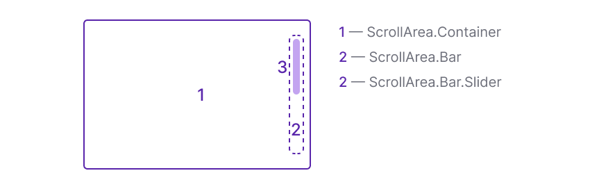

## Description

**ScrollArea** is a component that allows you to customize the native scroll functionality. It enables smooth navigation through content within a window or block, both vertically and horizontally.

## Component composition

The ScrollArea consists of the following elements:

- Container with content (`ScrollArea.Container`).
- Scroll indicator (`ScrollArea.Bar`).
- Slider (`ScrollArea.Bar.Slider`).

## Appearance

Table: ScrollArea styles

| Element                 | Styles                                      |
| ----------------------- | ------------------------------------------- |
| `ScrollArea.Bar`        | `background: transparent`                  |
| `ScrollArea.Bar.Slider` | `background: var(--scroll-bar-background)` |

## Interaction

Scrolling inside the block can be controlled by:

- Mouse wheel.
- Arrow keys while focusing on an element.
- Touchpad gestures.
- Elements of a scrollbar such as sliders and buttons.

<!-- @## Infinite scrolling

With infinite scrolling content is loaded in portions. This type of scrolling is especially good if there is a lot of content on the page, and you don’t need to divide it into separate pages.

::: tip
_Infinite scrolling helps to build a narration and sends the user on a journey._

(c) Roma Lysov 🤪 -->
:::

