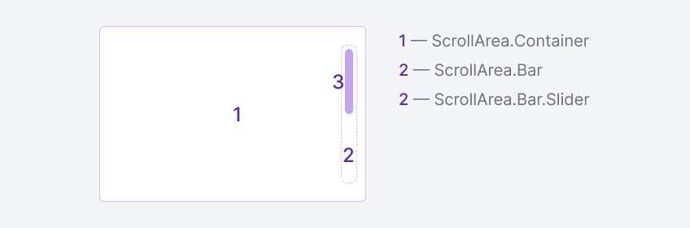

@## Description

**ScrollArea** is a component for customizing native scroll functionality. Scroll helps navigate through content inside a window/block vertically and/or horizontally.

@## Appearance

### Component composition

- Container with content (`ScrollArea.Container`).
- Scroll indicator (`ScrollArea.Bar`).

### Styles

Scrollbar has the following styles.

| Element                 | Styles                           |
| ----------------------- | -------------------------------- |
| `ScrollArea.Bar`        | `background: transparent;`       |
| `ScrollArea.Bar.Slider` | `background: rgba(0, 0, 0, .3);` |

@## Interaction

The scroll inside the block can be controlled by:

- mouse wheel;
- the arrow key while focusing on an element;
- touchpad gestures;
- elements of a scrollbar like sliders and buttons.

<!-- @## Infinite scrolling

With infinite scrolling content is loaded in portions. This type of scrolling is especially good if there is a lot of content on the page, and you do not need to divide it into separate pages.

> _Infinite scrolling helps to build a narration and sends the user on a journey._
>
> (c) Roma Lysov 🤪 -->

@page scroll-area-api
@page scroll-area-code
@page scroll-area-changelog
