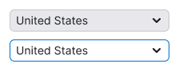
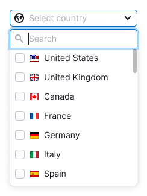
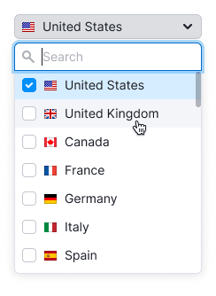
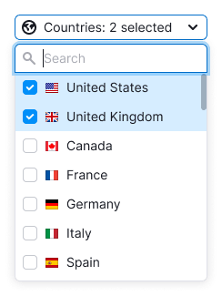

@## Description

**Select** is a component for selecting one or more values from the list. Optionally, it may contain search input, titles, buttons, grouping and nesting.

The component consists of:

- trigger (described in this guide);
- [dropdown](/components/dropdown-menu/).

@## Trigger

There are two types of select triggers.

**Button**. Has two sizes: M and L.

**Link**. Use it in two sizes: 14px text and 16px text.

**Link with the color of text**. Use it in two sizes: 14px text and 16px text.

| Size | ButtonTrigger                             | LinkTrigger                                | LinkTrigger with the color of text          |
| ---- | ----------------------------------------- | ------------------------------------------ | ------------------------------------------- |
| L    |  |  |  |
| M    |  |  |  |

### Maximum width

If trigger has a maximum width, then collapse long values into the ellipsis. When hovering, show the tooltip with the full value name.

@## Trigger states

| State         | ButtonTrigger                                    | LinkTrigger                                                | LinkTrigger with the color of text                          |
| ------------- | ------------------------------------------------ | ---------------------------------------------------------- | ----------------------------------------------------------- |
| default       |            |  |  |
| hover, active |  |          |          |
| placeholder   |    |  |  |
| loading       |            |      |      |
| valid         |                |          |            |
| invalid       |            |      |        |
| disabled      |          |    |    |

@## Trigger content

The select trigger can contain an icon, flag or other addon before the text.

[Badge](/components/badge/) should be placed to the right of the text. For all sizes, the margin between the badge and the text is 8px.

[Dot](/components/dot/) should be placed in the upper right corner of the trigger.

|        | Button                             | Link as Button                              | Link with the color of text                  |
| ------ | ---------------------------------- | ------------------------------------------- | -------------------------------------------- |
| Flag   |    |    |    |
| Icon   |    |    |    |
| Avatar |      |      |      |
| Badge  |  |  |  |

@## Dropdown (dropdown list)

You can read about the dropdown list, its content and states in [Dropdown-menu](/components/dropdown-menu/).

@## Multiselect

**Multiselect** is a select with the functionality to choose several items from a list. Items in such a list are represented by checkboxes.

If the list includes more than 10 values, add a search input. Otherwise, it will be difficult for the user to navigate among all values.

> Search input should receive the focus state when user opens the list. It will help the user to avoid extra clicks.

### Select all

If you have more than 3 values, add the `Select all` option at the very beginning of the list. When everything is selected, change it to `Deselect all`.

@## Work of multiselect

In long lists (for example, in the list of countries), the values selected by the user should be pinned to the very top of the list when the user has closed/opened the select.

| User opened select and started selecting the values.                                                  | User closed select.                                | User has reopened select, and the values he selected are pinned at the very top of the list. When unchecking these values, they remain in the same place. |
| ----------------------------------------------------------------------------------------------------- | -------------------------------------------------- | --------------------------------------------------------------------------------------------------------------------------------------------------------- |
|   |  |                                                                                                         |

### Displaying the selected values in the trigger

|                                                                                                                                      | Appearance example                                       |
| ------------------------------------------------------------------------------------------------------------------------------------ | -------------------------------------------------------- |
| If nothing is selected, write `Select` + the required value.                                                                         |  |
| If everything is selected, write `All`.                                                                                              |  |
| If user selected 1 or 2 values, show them in the trigger listing them with commas. If they do not match, add the text in `ellipsis`. |  |
| **The select has a label**. If more than 2 values are selected, add them to the Label: `N selected` construction.                    |  |
| **The select does not have a label**. If more than 2 values are selected, add them to the `N selected` construction.                 |  |

### Limit on value selection

- Sometimes user selection can be limited by the number of required values.
- In this case, once the user has selected the required number, all other values should receive the `disabled` status.

> Do not forget to inform the user that the choice is limited. This can be done, for example, by putting a hint next to input. Also you can add a tooltip to the values in the `disabled` state that explains why they are in this state.

@page select-a11y
@page select-api
@page select-code
@page select-changelog
