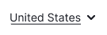
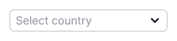
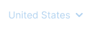
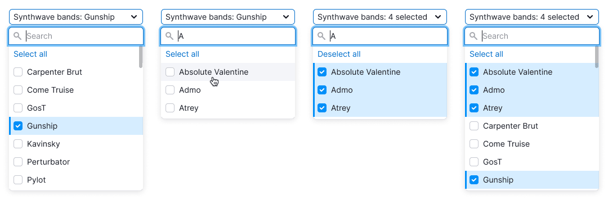
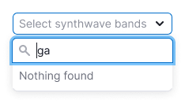
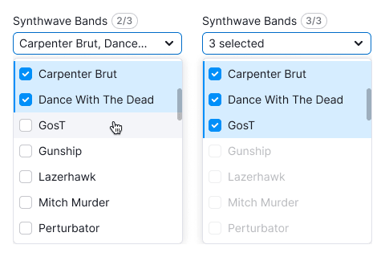

## Description

**Select** component allows users to choose one or more values from a list. It can optionally include a search input, titles, buttons, grouping, and nesting.

## Component composition

Component consists of the following:

- `Select.Trigger`
- `Select.Popper`
- `Select.InputSearch`
- `Select.List`
- `Select.Group`
- `Select.Option`
- `Select.Option.Checkbox`
- `Select.Option.Hint`

## Trigger

For the select trigger, you can use one of the following [BaseTrigger](/components/base-trigger/base-trigger) types:

Table: Trigger button types

| BaseTrigger type                                                                                                                                     | Appearance example                        |
| ---------------------------------------------------------------------------------------------------------------------------------------------------- | ----------------------------------------- |
| [ButtonTrigger](/components/base-trigger/base-trigger#buttontrigger). Has two sizes: M and L.                                                        |            |
| [LinkTrigger](/components/base-trigger/base-trigger#linktrigger) (looks like a link, but it's a button). Used in two sizes: 14px text and 16px text. |  |
| LinkTrigger styled like a link with text color (looks like a link, but it's a button). It's used in two sizes: 14px and 16px.                        |                   |

### Trigger sizes

Table: Trigger button sizes

| Size | [ButtonTrigger](/components/base-trigger/base-trigger#buttontrigger) | [LinkTrigger](/components/base-trigger/base-trigger#linktrigger) | LinkTrigger with the color of text |
| ---- | -------------------------------------------------------------------- | ---------------------------------------------------------------- | ---------------------------------- |
| M    |                                      |                                   |   |
| L    |                                      |                                   |   |

### Maximum width

If the trigger width is limited, collapse long values with an `ellipsis`. When hovering, show a [Hint](../tooltip/tooltip) with the full value.

## Trigger states

Table: Trigger button states

| State       | [ButtonTrigger](/components/base-trigger/base-trigger#buttontrigger) | [LinkTrigger](/components/base-trigger/base-trigger#linktrigger) | LinkTrigger with the color of text          |
| ----------- | -------------------------------------------------------------------- | ---------------------------------------------------------------- | ------------------------------------------- |
| Default     |                                       |                         |  |
| Hover       |                                         |                               |        |
| Active      |                                        |                               |        |
| Placeholder |                                   |                         |  |
| Loading     |                                       |                             |      |
| Valid       |                                         |                               |          |
| Invalid     |                                       |                             |        |
| Disabled    |                                      |                            |     |

When the value of the trigger isn't known while the select is loading, center the Spin within it.

Table: Trigger button loading state for the unknown value in the trigger

| State   | [ButtonTrigger](/components/base-trigger/base-trigger#buttontrigger) | [LinkTrigger](/components/base-trigger/base-trigger#linktrigger) | LinkTrigger with the color of text             |
| ------- | -------------------------------------------------------------------- | ---------------------------------------------------------------- | ---------------------------------------------- |
| Loading |                                |                      |  |

## Trigger content

The select trigger can contain an icon, flag, or other addon before the text. The [Badge](/components/badge/badge) should be placed to the right of the text. For all sizes, the margin between the badge and the text is 8px. The [Dot](/components/dot/dot) should be placed in the upper right corner of the trigger.

Table: Content types trigger button can have

| Element | [ButtonTrigger](/components/base-trigger/base-trigger#buttontrigger) | [LinkTrigger](/components/base-trigger/base-trigger#linktrigger) | LinkTrigger with the color of text |
| ------- | -------------------------------------------------------------------- | ---------------------------------------------------------------- | ---------------------------------- |
| Flag    |                                          |                                       |       |
| Icon    |                                          |                                       |       |
| Avatar  |                                           |                                        |        |
| Badge   |                                         |                                      |      |

## Menu

Menu in `Select` is based on `DropdownMenu`, so refer to [DropdownMenu](/components/dropdown-menu/dropdown-menu) for basic properties of the menu and its items. This guide describes features specific for `Select`.

### Height

If the menu has more than seven items, limit its height and add scroll. We also recommend adding search input to such lists.

### List states

- If the list is taking a long time to load or filter results (for example, due to a slow connection), then display "Loading...".
- If a user enters a value that isn’t in the list, then display "Nothing found".
- If there are backend errors, a warning message should be displayed with the text "Something went wrong. Please try again later."

### Data loading

When the list is loading or data is being fetched, replace the `Chevron` icon with an XS spinner, and keep the trigger non-clickable in its default state.

### List with search input

If the list includes a search input, the input automatically receives focus when the dropdown is opened.

As the user enters a value into the input, only the items that match the input should remain in the list. Don’t highlight these items in this case.

### List item states

Table: Select menu item states

| State               | Appearance                        | Tokens                                |
| ------------------- | --------------------------------- | ------------------------------------- |
| Default             |       | `--dropdown-menu-item`                |
| Hover               |         | `--dropdown-menu-item-hover`          |
| Selected            |        | `--dropdown-menu-item-selected`       |
| Selected with hover |  | `--dropdown-menu-item-selected-hover` |
| Disabled            |      | `--disabled-opacity`                  |

### Pinned item

You can pin an item with a title, input, notice or a button on the top or at the bottom of the list. Such item should be separated by a [Divider](/components/divider/divider) and fixed while scrolling the list.

Table: Pinned item examples

| Item content      | Appearance example                                           | Description                                                                                                                                                                                   |
| ----------------- | ------------------------------------------------------------ | --------------------------------------------------------------------------------------------------------------------------------------------------------------------------------------------- |
| Title             |                                 | Fixed title refers to the entire list and it should have a [Divider](/components/divider/divider).                                                                                            |
| Input with search |                                   | If the list has more than 10 items, add the search input. When user opens the list, the input gets the `focus` state. For a placeholder use the text: “Start typing {parameter}” or "Search". |
| Notice            |   | The notice title should have the same size as the text has and `font-weight: var(--bold)`.                                                                                                    |
| Button            |                                  |                                                                                                                                                                                               |

## Multiselect

**Multiselect** is a select type with the functionality to choose several items from a list. Items in such a list include checkboxes.

If the list includes more than 10 values, add a search input. Otherwise, it will be difficult for the user to navigate among all values.

### Select all

If the list contains more than three values, display the **Select all** action at the very beginning of the list. There are two ways in which **Select all** can switch to **Deselect all**, depending on likely user behavior:

* if users are likely to select only a few items, or reset the selection often, switch when at least one item is selected
* if users are likely to select most or all items, switch only when all items are selected

## Specific multiselect cases

In long lists (for example, countries or time zones), selected values should be placed at the top of the list when the list is opened.

Table: Specific cases for multiselect

| Step                                                                                                                                                   | Illustration                         |
| ------------------------------------------------------------------------------------------------------------------------------------------------------ | ------------------------------------ |
| User opens the select and starts selecting items.                                                                                                      |  |
| User closes the select.                                                                                                                                |    |
| When user reopens the select, selected items are at the top of the list. If user deselects the items, they remain in place until the select is closed. |  |

### Displaying selected values in trigger

Table: States for displaying the selected values in the trigger

| Case                                                                                                                                      | Appearance example                    |
| ----------------------------------------------------------------------------------------------------------------------------------------- | ------------------------------------- |
| If nothing is selected, write "Select" + the required value.                                                                              |  |
| If everything is selected, write `All`.                                                                                                   |  |
| If the user selects 1 or 2 values, show them in the trigger listing them with commas. If they don’t fit, collapse the text in `ellipsis`. |  |
| **The select has a label.** If more than 2 values are selected, add them to the "Label: N selected" construction.                         |  |
| **The select doesn't have a label.** If more than 2 values are selected, add them to the "N selected" construction.                       |  |

### Search

If the user searches for something and clicks **Select all** or **Deselect all**, all found results will be selected or deselected. Other values, those that haven’t been searched for, don’t change their state.

For example, if the user has selected the "Gunship" and then searches for the "A" bands, then clicks **Select all**, three more visible bands will be selected. As a result, four values will be marked as selected (three bands that start with "A" and the previously checked "Gunship").

Don’t show **Select all** or **Deselect all** when the user has searched and got no results.

### Limit on item selection

- Sometimes, user selection can be limited by the number of required items.
- In this case, once the user has selected the required number, all other items should receive the `disabled` state.
- Inform the user that the choice is limited. This can be done, for example, by putting an [Informer](../../patterns/informer/informer.md) next to the input label. Also, you can add a tooltip to the items in the `disabled` state that explains why they got this state.

::: tip
Hide the **Select all** and **Deselect all** buttons from lists where the maximum number of selected options is limited.
:::

