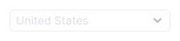
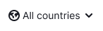
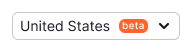
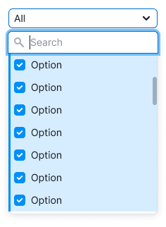
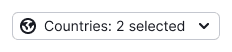
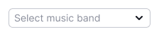
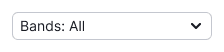
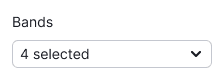
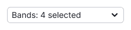

@## Description

**Select** is a component for selecting one or more values from the list. Optionally, it may contain search input, titles, buttons, grouping and nesting.

The component consists of:

- trigger (described in this guide);
- [dropdown](/components/dropdown-menu/).

@## Trigger

For a select trigger you can use the following BaseTrigger types:

| BaseTrigger type | Appearance example |
| ---------------- | ------------------ |
| **BaseTrigger**. Has two sizes: M and L. |  |
| **LinkTrigger (looks like a Link, but it's a button)**. Use it in two sizes: 14px text and 16px text. |  |
| **LinkTrigger with the color of text (looks like a Link, but it's a button)**. Use it in two sizes: 14px text and 16px text. |  |

| Size | ButtonTrigger                             | LinkTrigger                                | LinkTrigger with the color of text          |
| ---- | ----------------------------------------- | ------------------------------------------ | ------------------------------------------- |
| M    |  |  |  |
| L    |  |  |  |

### Maximum width

If trigger has a maximum width, then collapse long values into the ellipsis. When hovering, show the tooltip with the full value name.

@## Trigger states

| State         | ButtonTrigger                                    | LinkTrigger                                                | LinkTrigger with the color of text                          |
| ------------- | ------------------------------------------------ | ---------------------------------------------------------- | ----------------------------------------------------------- |
| Default       |            |  |  |
| Hover, active |  |          |          |
| Placeholder   |    |  |  |
| Loading       |            |      |      |
| Valid         |                |          |            |
| Invalid       |            |      |        |
| Disabled      |          |    |    |

@## Trigger content

The select trigger can contain an icon, flag or other addon before the text.

[Badge](/components/badge/) should be placed to the right of the text. For all sizes, the margin between the badge and the text is 8px.

[Dot](/components/dot/) should be placed in the upper right corner of the trigger.

|        | Button                             | Link as Button                              | Link (as Button) with the color of text                  |
| ------ | ---------------------------------- | ------------------------------------------- | -------------------------------------------- |
| Flag   |    |    |    |
| Icon   |    |    |    |
| Avatar |      |      |      |
| Badge  |  |  |  |

@## Dropdown (dropdown list)

You can read about the dropdown list, its content and states in [Dropdown-menu](/components/dropdown-menu/).

@## Multiselect

**Multiselect** is a select with the functionality to choose several items from a list. Items in such a list are represented by checkboxes.

If the list includes more than 10 values, add a search input. Otherwise, it will be difficult for the user to navigate among all values.

> Search input should receive the focus state when user opens the list. It will help the user to avoid extra clicks.

### Select all

If you have more than three values, add the "Select all" option at the very beginning of the list. When everything is selected, change it to "Deselect all".

@## Specific cases for multiselect

In long lists (for example, in the list of countries), the values selected by the user should be pinned to the very top of the list when the user has closed/opened the select.

| User opened select and started selecting the values.                                                  | User closed select.                                | User has reopened select, and the values he selected are pinned at the very top of the list. When unchecking these values, they remain in the same place. |
| ----------------------------------------------------------------------------------------------------- | -------------------------------------------------- | --------------------------------------------------------------------------------------------------------------------------------------------------------- |
|   |  |                                                                                                         |

### Displaying the selected values in the trigger

|                                                                                                                                      | Appearance example                                       |
| ------------------------------------------------------------------------------------------------------------------------------------ | -------------------------------------------------------- |
| If nothing is selected, write `Select` + the required value.                                                                         |  |
| If everything is selected, write `All`.                                                                                              |  |
| If user selected 1 or 2 values, show them in the trigger listing them with commas. If they do not match, add the text in `ellipsis`. |  |
| **The select has a label**. If more than 2 values are selected, add them to the Label: `N selected` construction.                    |  |
| **The select does not have a label**. If more than 2 values are selected, add them to the `N selected` construction.                 |  |

### Search

If user searches for something and clicks "Select all" or "Deselect all", all found results will be selected or deselected. Other values, those that have not been searched for, do not change their state.

For example, if the user has selected the "Gunship" and then search for the "A" bands, then clicked "Select all", three more visible bands will be selected. As a result, four values will be marked as selected (three bands that started with "A" and the previously checked "Gunship").

Do not show "Select all" or "Deselect all" at the time when the user has searched and got no results.

### Limit on value selection

- Sometimes user selection can be limited by the number of required values.
- In this case, once the user has selected the required number, all other values should receive the `disabled` status.
- Inform the user that the choice is limited. This can be done, for example, by putting a hint next to the input's label. Also you can add a tooltip to the values in the `disabled` state that explains why they are in this state.

> We recommend hiding the "Select all" and "Deselect all" buttons for the lists with limitations, because for such cases user cannot select or deselect all options due to limitations.

@page select-a11y
@page select-api
@page select-code
@page select-changelog
