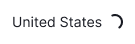
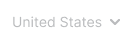
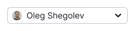
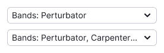

@## Description

**Select** is a component for selecting one or more values from the list. Optionally, it may contain a search by values, titles, buttons, grouping and nesting.

The component consists of:

- trigger (which is described in this guide);
- [dropdown](/components/dropdown-menu/) (which is described in another guide).

@## Trigger

There are two types of select triggers of different importance in our interface.

**Button**. We use it in three sizes: M (28px in height, 14px text), L (40px in height, 16px text).

**Link**. We use it in two sizes: M (14px text), L (16px text).

**Link with the color of text**. We use it also in two sizes: M (14px text), L (16px text).

| Size | ButtonTrigger                             | LinkTrigger                                | LinkTrigger with the color of text          |
| ---- | ----------------------------------------- | ------------------------------------------ | ------------------------------------------- |
| L    |  |  |  |
| M    |  |  |  |

@## Trigger states

| State         | ButtonTrigger                                    | LinkTrigger                                                | LinkTrigger with the color of text                          |
| ------------- | ------------------------------------------------ | ---------------------------------------------------------- | ----------------------------------------------------------- |
| default       |            |  |  |
| hover, active |  |          |          |
| placeholder   |    |  |  |
| loading       |            |      |      |
| valid         |                |          |            |
| invalid       |            |      |        |
| disabled      |          |    |    |

@## Content and sizes

The select may contain an icon, flag or user picture in front of the text. [Badge (micro label)](/components/badge/) may stand to the right of the trigger. For all sizes, the indent between the badge and the select is 8px.

A [dot ("mandarinka")](/components/dot/) may be in the upper right corner of the trigger.

|        | Button                             | Link as Button                              | Link with the color of text                  |
| ------ | ---------------------------------- | ------------------------------------------- | -------------------------------------------- |
| Flag   |    |    |    |
| Icon   |    |    |    |
| Avatar |      |      |      |
| Badge  |  |  |  |

### Content sizes

If a fixed width of a multiselect trigger is specified, the selected values are added to the ellipsis. When hovering, the tooltip with the full name is shown. The minimum distance between the chevron and the trigger content is 8px.

@## Dropdown and its states (dropdown list)

> 💡 You can read about the dropdown list, its content and statuses in [Dropdown-menu](/components/dropdown-menu/).

@## Multiselect

**Multiselect** is a select with the ability to choose several items from a list. Options in such a list are represented by checkboxes and are not highlighted by color when hovering over them.

If the list includes more than 10 values, you should add an input with the search. Otherwise, it will be difficult for the user to navigate among all values.

> 💡 Do not forget to put the search field in the focus state when opening the list. This helps the user to avoid extra clicks.

### Select all

- If you have more than 3 values, you can add the `Select all` option at the beginning of the list.
- When everything is selected, it changes to `Deselect all`.

@## How multiselect works

In long lists with values (for example, in the list of countries), the values selected by the user should be raised to the very top of the list. However, this should happen when the user has closed/opened the select.

| The user opened the select and started selecting the values.                                          | The user closed the select.                        | The user has reopened the select, and the values he selected are fixed at the beginning of the list. When unchecking these values, they remain in the same place. |
| ----------------------------------------------------------------------------------------------------- | -------------------------------------------------- | ----------------------------------------------------------------------------------------------------------------------------------------------------------------- |
|   |  |                                                                                                                 |

### Displaying the selected values in the trigger

|                                                                                                                                      | Appearance example                                       |
| ------------------------------------------------------------------------------------------------------------------------------------ | -------------------------------------------------------- |
| If nothing is selected, write `Select` + the required value.                                                                         |  |
| If everything is selected, write `All`.                                                                                              |  |
| If user selected 1 or 2 values, show them in the trigger listing them with commas. If they do not match, add the text in `ellipsis`. |  |
| **The select has a label**. If more than 2 values are selected, add them to the Label: `N selected` construction.                    |  |
| **The select does not have a label**. If more than 2 values are selected, add them to the `N selected` construction.                 |  |

### Limit on value selection

- Sometimes user selection can be limited by the number of required values.
- In this case, once the user has selected the required number, all other values should receive the `disabled` status.

> 💡 Do not forget to inform the user that the choice is limited. This can be done, for example, by putting a tip next to input. In addition, you can add a tooltip to the values in the `disabled` state that explains why they are in this state.

@page select-a11y
@page select-api
@page select-code
@page select-changelog
