@## Description

**SidePanel** is a component for displaying the sliding panel (from the right, from the bottom or from the left). Sometimes we call it "panel" or drawer.

Use this component when it is simultaneously needed:

- to show sub-tasks, additional support information and links that may be useful to the user when working with a separate report, a specific widget or the whole platform;
- to keep the user in the context of the page (even if SidePanel has a fader).

> [Modal windows](/components/modal/) are used in cases where we show important information or request a response from the user.

**For example, we are using SidePanel in:**

- Notification center for the whole Semrush platform;
- Help Center and News in Tools;
- "panels" on mobile devices.

@## Triggers

- Special icon Notification in the main header of Semrush.
- Auxiliary link in ProductHead.

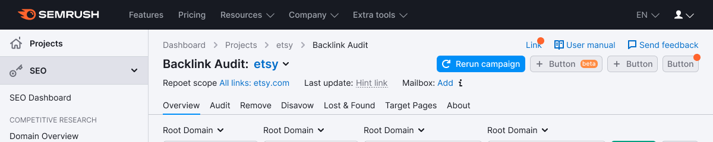

- Controls inside the report that hide additional information.
- Charts inside the report, which can be clicked on to see additional information.
- On small screens where we can use the SidePanel moving from below, other interface controls can serve as a trigger.

@## Component composition

- container;
- content;
- closure icon (optional);
- fader (optional).

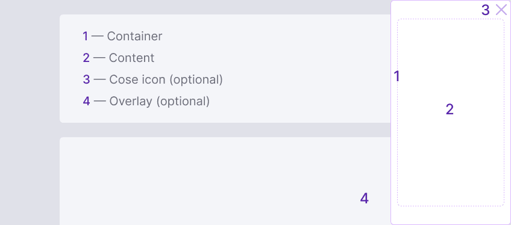

@## Themes

Default theme is `light`.

| Theme                | Appearance example                     | Styles                                                                                                         | When to use                                                                                                        |
| -------------------- | -------------------------------------- | -------------------------------------------------------------------------------------------------------------- | ------------------------------------------------------------------------------------------------------------------ |
| light, without fader | 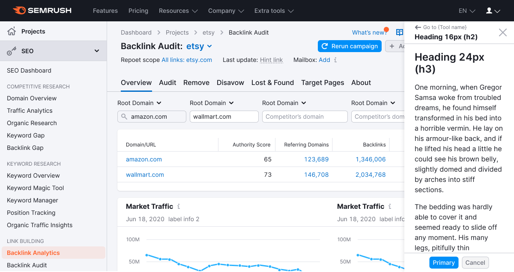 | In these case the panel has the shadow: `box-shadow: 0px 3px 8px rgba(0, 0, 0, 0.2);`. There is no fader.      | This is a default theme if you need to show additional information for a report/tool/block.                        |
| dark, without fader  | 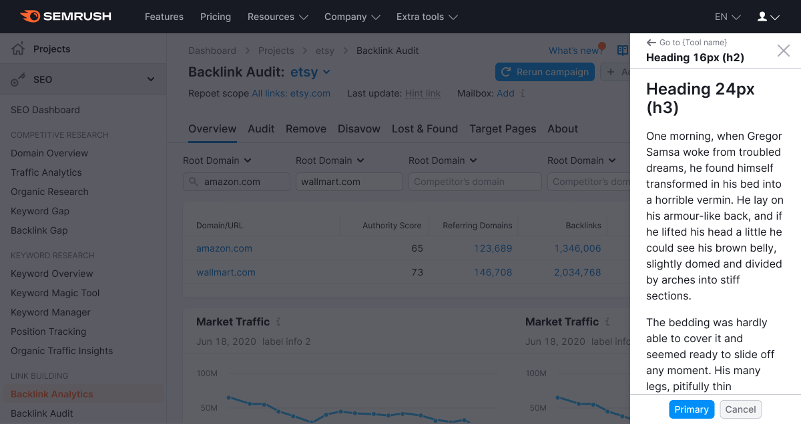   | In this theme panel has a fader with styles – `opacity: 0.8;` `background: --var(black);`. There is no shadow. | If you need to concentrate the user on information inside SidePanel (by modal type), it is useful to enable fader. |

@## Default sizes and indents

### Width

SidePanel has a fixed width that does not change when the browser window is resized. **Default width of the panel is 256px.** You can change it if necessary.

### Container

**The component has a default padding.** It can be changed if necessary.

_It can be changed, for example, when using SidePanel on a small screen where you want to reduce indents or if you need to enlarge them for the composition in a bigger window for the Notification center._

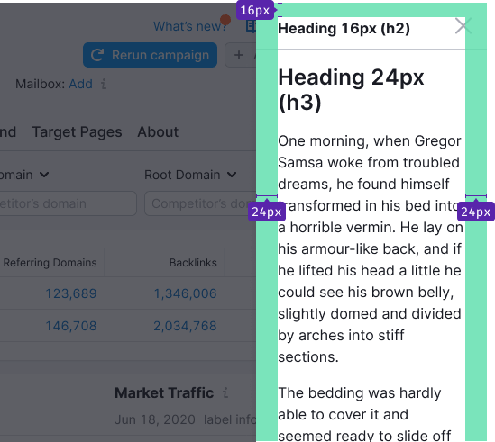

### Content indents

The main indent between title and content:

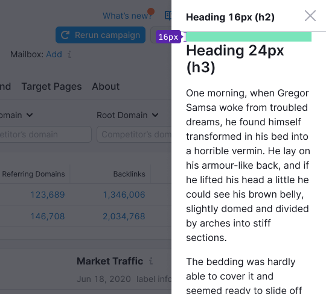

@## Common styles and recommendations

### Header

By default, total header is 16px (variables: `--fs-300; --lh-300`), `font-weight: 700;`.

> 💡 The header is pinned when scrolling large content inside the SidePanel.

| Appearance example                    | Styles                                                                                                       |
| ------------------------------------- | ------------------------------------------------------------------------------------------------------------ |
| 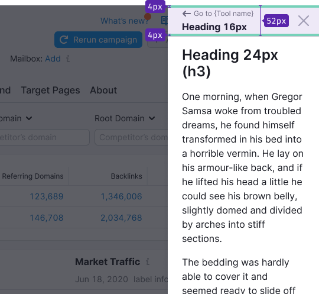 | `height: 56px; padding-bottom: 8px; align-items: center; border-bottom: 1px solid var(–gray80);`             |
| 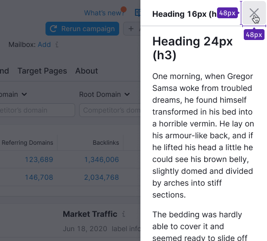   | Size of the `Close` icon is M, color of the icon is `--var(stone)`. Click area of the icon is `40px * 40px`. |

### Content

General recommendations for SidePanel content styles are described below.

- Choose the text size for the panel in order to maintain a hierarchy of headers in the content within SidePanel (this is usually 16px, 14px and 12px text). If necessary, you can experiment and use your text size hierarchy within our [typogarphic scale](/style/typography/). Remember the font sizes that are already used on the product page ☝🏻

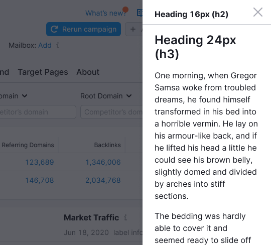

- If there is a lot of content in SidePanel, scroll will appear inside.

> **We always pin the header and the bottom part with controls, if any, when scrolling the content.**.

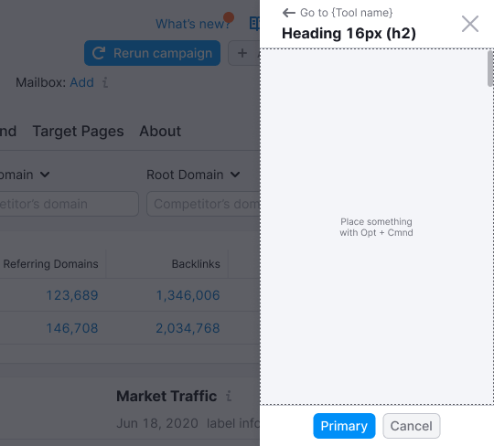

> 💡 Detailed styles for each specific pattern (Help center, News, Notification center) can be found in the corresponding guides.

### Footer

You can place common controls for SidePanel content in the footer.

- Typically, any controls, CTA or other elements like [ProgressBar](/components/progress-bar) can be placed there.

> 💡 A footer with controls is pinned when scrolling large content inside a SidePanel.

- In case SidePanel content is separated and has separate CTAs and controls, it makes no sense to place them in the footer 🤷🏻‍♀️
- The recommended size of controls in the panel on the desktop is M (26px height). Depending on the context, use L or XL controls in the panel on small screens.

Footer styles:

```css
height: 42px;
padding: 8px 0;
align-items: center;
border-top: 1px solid var(–gray80);
```

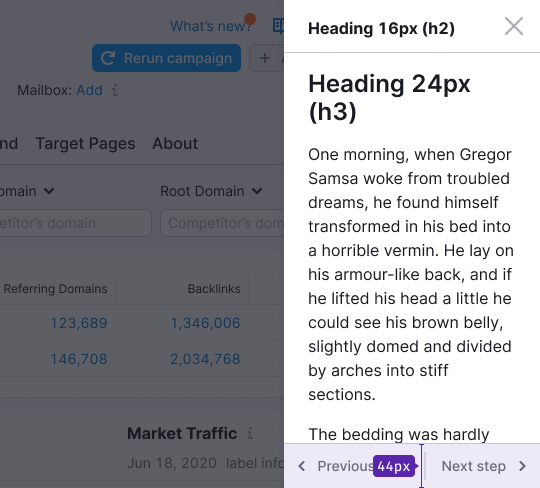

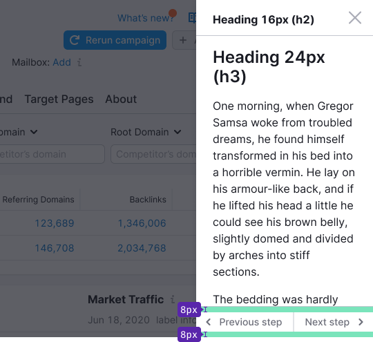

@## Interaction

### Placement in the interface

- You can customize whether the SidePanel should open in the tool area or over the entire Semrush (as modal windows do). If the SidePanel refers to a specific tool, it will be rendered in the tool under the main Semrush header. This is still a more common case. You can see the implementation in the [Code](/components/side-panel/side-panel-code/#aae13e) tab.
- The focus remains inside the SidePanel and does not move to the page content. You can navigate through the controls using `Tab`.

### Scroll operation

Page scroll is controlled. You can turn it on/off.

For example, page scrolling should be enabled when SidePanel has some tips and additional things for the whole report.

> 💡 It is important to disable page scroll for SidePanel with fader, otherwise it will look like a bug.

### SidePanel opening and closing

You can close the panel with the help of ~~black magic~~:

- `CTA`-control;
- `Close` icon;
- Clicking outside the area of the panel (at fader), optional;
- `Esc`.

SidePanel can be opened either by user clicking on the corresponding trigger or by the system in special cases to draw attention to the information in the panel.

### Animation of appearance and hiding

SidePanel opens and closes with the animation: `transition: all 350ms ease-in-out;` ✨

### What happens when the browser window size changes

- SidePanel has a fixed width that does not change when the browser window is resized. Default width of the panel is 256px. You can change it if necessary.
- On a 320px screen, SidePanel should not occupy more than 80% of the screen width so that the user can click outside of it and close it.

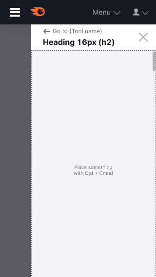

@## Corner states

> 💡 We keep the SidePanel header in all cases.

### Initial load

At the initial load of the SidePanel content, we show the structure with the help of the universal [Skeleton](/components/skeleton/).

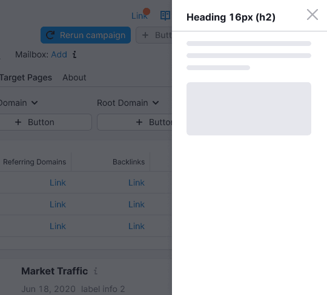

### Reloading

When loading and reloading SidePanel content, we show an [XL size spinner](/components/spin/) in the center.

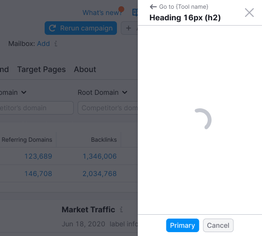

### Error

If an error occurs during data loading, we show the error status in the center with the corresponding text and the `Reload` button to reload the SidePanel content.

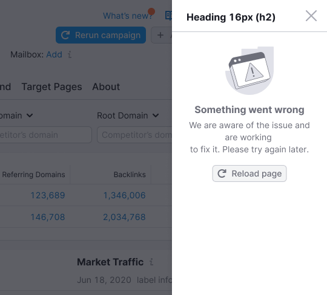

@page side-panel-a11y
@page side-panel-api
@page side-panel-code
@page side-panel-changelog
