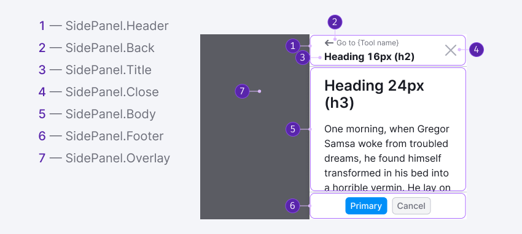

## Description

**SidePanel** is a component used for displaying sliding panels with content. It can also be referred to as a panel or drawer.

**Use SidePanel when you need:**

- To show sub-tasks, additional support information, and links that may be useful to the user while working with a report, a specific widget, or the entire product.
- To keep the user in the context of the page (even if the SidePanel has an overlay).

::: tip
Use [Modal dialogs](/components/modal/modal) to show important information or request a response from the user.
:::

**For example, you can use SidePanel as:**

- A notification center for the whole website
- A Help Center or News panel in products
- "Panels" on mobile devices

## Component composition



Component consists of the following:

1. `SidePanel.Header`
2. `SidePanel.Back`
3. `SidePanel.Title`
4. `SidePanel.Close`
5. `SidePanel.Body`
6. `SidePanel.Footer`
7. `SidePanel.Overlay`

## Trigger

The trigger for opening the SidePanel can be the following:

- A **News** icon in the main header of the website.
- Additional links in [ProductHead](/components/product-head/product-head).
- Controls that hide additional information.
- Charts that can be clicked to show additional information.
- On small screens, other controls can serve as triggers to open SidePanel.

## Overlay

Table: SidePanel with and without overlay

|                 | Appearance example                     | Styles                                                                                                           | When to use                                                                             |
| --------------- | -------------------------------------- | ---------------------------------------------------------------------------------------------------------------- | --------------------------------------------------------------------------------------- |
| Without overlay |  | In this case the panel has only the shadow: `box-shadow: 0px 1px 12px var(--box-shadow-popper)`. There is no overlay. | Use this version if you need to show additional information for a report/product/block. |
| With overlay    |    | In this case panel has an overlay with styles: `background-color: var(--overlay-primary)`.   | If you need to focus the user on information inside SidePanel, enable overlay.          |

## Appearance

### Sizes and indents

#### Width

SidePanel has a fixed width that doesn't change when the browser window is resized. The default width of the panel is 260px. You can change it if necessary.

#### Container

**The component has a default padding.** It can be changed if necessary.

_It can be changed, for example, when using SidePanel on a small screen where you want to reduce paddings._


### Content styles

General recommendations for `SidePanel` content styles:

- Use a `--spacing-4x` (16px) padding between the title and the content:


- Choose the text size for the panel to maintain a hierarchy of headers in the content within `SidePanel`. If necessary, you can experiment and use your text size hierarchy within our [typographic scale](/style/typography/typography).


- Always pin the header and the footer when scrolling the content of the `SidePanel`.


### Footer styles

You can place common `SidePanel` controls in the footer.

- Typically, any controls, CTA, or other elements like [ProgressBar](/components/progress-bar/progress-bar) can be placed there.
- The recommended size of controls in the panel on the desktop is M. Depending on the context, use M or L controls in the panel on small screens.

Footer styles:

```css
padding: var(--spacing-2x) 0;
align-items: center;
```


## Interaction

### Placement in the interface

- You can customize whether the panel should open in the product area or over the entire website (as modal windows do). If the SidePanel refers to a specific product, it should be rendered in the product under the main header.
- The focus remains inside the panel and doesn't move to the page content. You can navigate through the controls inside the SidePanel using  `Tab`.

### Page scroll

Page scroll is disabled by default. We recommend you to enable it only when SidePanel has some tips and additional information for the page, and no overlay is enabled.

::: tip
Always disable page scroll for SidePanel with an overlay.
:::

### SidePanel opening and closing

You can close the panel with:

- CTA control;
- **Close** button;
- Clicking outside the area of the panel (at overlay), optional;
- `Esc` key.

SidePanel can be opened either by the user clicking on the corresponding trigger or by the system in special cases to draw attention to the information in the panel.

### Animation of appearance and hiding

SidePanel opens and closes with the animation: `transition: all 350ms ease-in-out`.

**What happens when the browser window size changes:**

- The SidePanel has a fixed width that doesn’t change when the browser window is resized. The default width of the panel is 260px, but you can change it if needed.
- On a 320px screen, the SidePanel should not occupy more than 80% of the screen width to ensure that the user can click outside of it to close it.


## Edge cases

`SidePanel.Header` should be visible even in loading, empty and error states.

### Initial load

At the initial load of the content, show the content structure with [Skeleton](/components/skeleton/skeleton).


### Reloading

While loading or reloading content, show a [SpinContainer](/components/spin-container/spin-container) of XXL size.


### Error

If an error occurs during data loading, show a suitable message and a button to reload the content. Refer to [WidgetEmpty](../widget-empty/widget-empty.md#something-went-wrong) for more details.


