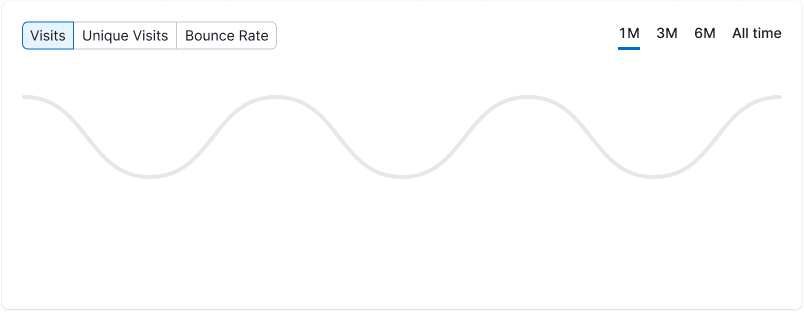
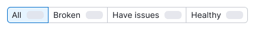
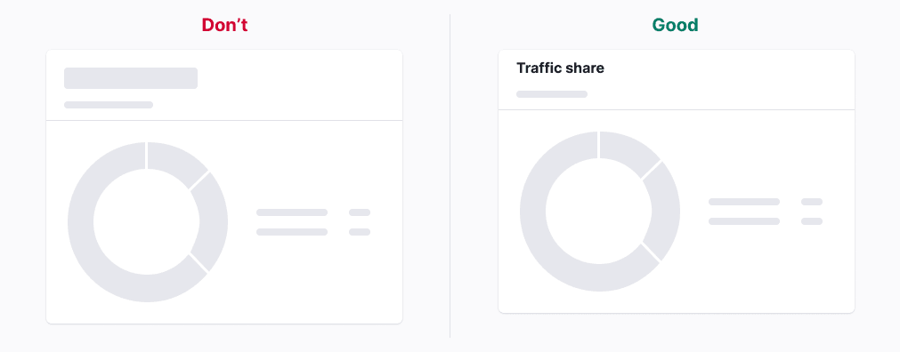
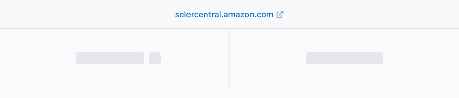
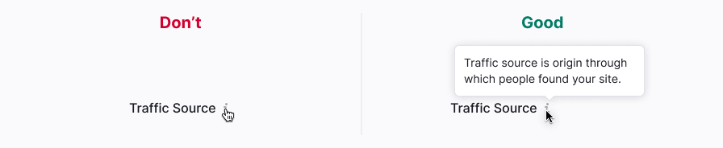

> ⚠️ The component has a major version, changes are in the [migration guide](/internal/migration-guide).

@## Description

> 💡 This component is one of the components that displays the download and reaction to user actions in the interface. For general rules on such components, see the [Loading patterns](/patterns/loading-states/).

**Skeleton** is a component for displaying the structure of a block and/or a page during their initial loading. Skeletons are needed to form user's ideas about downloaded data.

The "bone" is an element of the skeleton.

### Distinctive features

- It is used if the content is loading from 0 to 5 seconds. If it takes more time, it is used in combination with [ProgressBar](/components/progress-bar/).
- Several skeletons can be shown simultaneously or asynchronously when loading each new element.
- It is used when the number and approximate layout of elements are known in advance.

@## Themes

The skeletons has [two themes](/components/skeleton/skeleton-api/), namely, `dark` and `invert` for use on a light and dark/colored background, respectively.

All skeleton “bones” have `border-radius of 4px;`.

| Theme  | Appearance example                     | Styles                                                                                        |
| ------ | -------------------------------------- | --------------------------------------------------------------------------------------------- |
| dark   |  | Main color is `#EDEFF0`. Color of the moving part is `#FAFBFB`.                               |
| invert |    | Main color is `rgba(255,255,255,0.10)`. Color of the moving part is `rgba(255,255,255,0.30);` |

@## Animation

Our skeletons are animated. You can see the live skeleton animation in the [Code](/components/skeleton/skeleton-code) tab.

One animation is added per data block (widgets, tables, graphs). There is no need to synchronize it between different blocks, as it may affect the page loading time.

Content appearance animation is 300 ms with `ease-out`.

> 💡 In case you do not need animation in the skeleton (for example, when a modal window with a limit or registration opened on the page), you can stop the animation using the API property `duration="0"` 🕺🏻

@## How to skeleton different components and elements on a page?

### Paragraph

Any paragraph of our design system is replaced by one kind of skeleton.

- We always show only three "bones".
- The width of "bones" is equal to the width of the paragraph, but not more than 600px (except for the blog).
- The length of the last "bone" is 3/4 of the previous two "bones".

### Headers

Each header is replaced by a "bone", the height of which is equal to the line-height.

- The header is always replaced by only one "bone", even if the header consists of two lines.
- The width of "bones" is 150px. In rare cases, you can increase it, if it is necessary.

| h#  | Appearance                    |
| --- | ----------------------------- |
| h1  |  |
| h2  |  |
| h3  |  |
| h4  |  |
| h5  |  |
| h6  |  |

### Images

The skeleton of images depends on their size:

- Images of small size: user pictures, preview of advertising
- Images of big size: big screenshots on the landings, pictures in the blog and instructions.

**Images of small size** are shown by the “bone” corresponding to the image size, and are immediately replaced by the real image at loading.

| Step                            | Example                                |
| ------------------------------- | -------------------------------------- |
| 1. Placeholder and skeleton     |       |
| 2. Replace by pictures and text |  |

**Images of big size** are shown as follows:

> 💡 In cases when it is possible from the technical point of view, you can skip the first step of the next scheme for large images.

| Step                                                                                                   | Пример                                        |
| ------------------------------------------------------------------------------------------------------ | --------------------------------------------- |
| 1. Placeholder and skeleton                                                                            |       |
| 2. Small pictures and skeleton are replaced by text and user picture, the large one is loaded blurred. |  |
| 3. Big picture is loaded fully                                                                         |   |

### Icons

In most cases, we do NOT skeleton the icons. We either do not show them or leave them in the state of `disabled`.

If suddenly you need to show a "bone" instead of an icon, the size of "bone" will be equal to the size of the icon. If there are several icons, the distance between them is 12px.

### Charts

General rules:

- Do not show axes and text to them.
- The legend is replaced by a skeleton.
- A graph is a form that can be given by a formula.

> 💡 In exceptional cases

For a more detailed guide, see the [Data Visualization](/data-display/data-visualization/).

### Buttons and Links

Buttons and links can be divided into two types:

- Those that take the user to another page.

**When downloading, we leave them as is.**

- Those that interact with the downloaded content and confirm / apply / upload what the user did on the page, for example, the buttons for exporting or adding something and so on.

When loading such controls, we **set the control to disabled status** so that nothing happens at full loading. It is recommended to skeleton links that do something like this.

> 💡 An interesting case has appeared, when we do not know what type (primary or secondary) of the button will be loaded (depends on different extreme cases of UX script). In this case, the button should be skeletonized 🤷🏻‍♀️

@## When to use

The skeleton shows the structure of the page/component as long as it is loaded so that the user has a preliminary view (mental model 🤓) of the loaded information. In other words, it is a simplified page view. Therefore, it is not recommended to skeleton every component on the page.

[Spin](/components/spin/) is necessary to display a response to the user action. Please wait, the system will think and respond 🙃

Skeletons are recommended for using at:

- Initial loading;
- The whole page loading;
- Complex component loading.

> 💡 It is not recommended to use skeleton for pages that are indexed by Google (for example, blog pages).

@## When and how to download data

Data is more important than skeletons, animations and everything else. As soon as it is possible to show data, we show it.

**Skeletons are recommended to be used when loading takes from 1 to 5 seconds.**

- Data of cards and widgets can be loaded asynchronously and not in sequence. The main thing is that the contents of the widget/card are loaded simultaneously.
- It is better to load the data in tables either at once or sequentially so that the lines do not change their places.
- In other cases, it is better to load data in groups: panel summary group, select group, etc.

> 💡 If the loading takes more than 5 seconds, but it is necessary to show the already loaded data (for example, in Brand Monitoring or in Topic Research), it is recommended to use skeleton paired with the [ProgressBar](/components/progress-bar/) component.

@## Things to be skeletonized

The information on the page can be divided into 2 categories.

### Static information (no need to skeleton)

This is text, data and components that do not depend on user actions and tool settings. They include:

- Names of tools;
- Titles of widgets, tips;
- Table headers;
- Components of the action, which are buttons, inputs, toggles and pills.

These components do not require additional loading and can be displayed immediately. Therefore, in most cases, the skeleton does not replace them.

### Dynamic information (should be skeletonized)

This information requires additional request and a long time to load. It varies depending on the user's actions and specific projects. In most cases, this group includes:

- cards;
- tables;
- charts, project statistics;
- selects.

The uploaded information will be skeletonized.

In addition, the following components should never use the skeleton, as they should be loaded by the time the user interacts with them:

- [NoticeBubble](/components/notice-bubble/);
- [Dropdown](/components/dropdown/) (Selects and dropdowns are loaded immediately. However, if the dropdown contains 😦 a table with data, you can skeleton it);
- [Tooltip](/components/tooltip/);
- [Modal](/components/modal/) (fullscreen modals belong to a new page, where data can be loaded, so they can be skeletonized);
- [Spin](/components/spin/).

@## Use in UX/UI

### Table

#### Primary таблицы

- Only three lines are shown.
- It is not recommended to make many different lengths of "bones", use 1-2 sizes.
- Text is replaced with skeleton and centered vertically at the line-height.
- Links are replaced by gray "bone".
- A reduced copy of the [area chart](/data-display/area-chart/) skeleton replaces graph-trends.
- Line controls are recommended to be disabled.
- Table header and sorting are active.

#### Secondary таблицы

- Standard “bones” replace the text; they are centered vertically at the text line-height.
- Try to use two or three sizes of “bones”.
- Links are replaced by gray "bone".
- Additional information and external link icons are not displayed in the second column.
- The header is active.
- In widgets, where the maximum number of lines is 5, you can show them al.

### Chart

- Pill switches are active.
- The legend is replaced by “bones" of the same size with an indent of 16px. The "bone" is centered vertically towards the checkboxes.
- If the legend is known in advance, we keep it.
- The chart is replaced with the skeleton state corresponding to the chart type. See more in [Data Visualization](/data-display/data-visualization/).

### PanelSummary

- Trends, information and additional links are not shown.
- Info icons are active.
- Icons inside the PanelSummary are replaced by a rectangle with the size of the icons.
- The metrics are replaced by skeleton with line-height.

### Pills

Pills are never disabled. They are always active so that the user can navigate to the tab he needs.

#### Pills with a number

At the initial loading of the page, the counters in the pills are skeletonized. For more information on the stages of page loading, see [Web-performance](/patterns/web-performance/) 🙌🏻

#### Big pills 👑

They are skeletonized by analogy with the PanelSummury:

- trends, information and additional links are not shown;
- the metrics are replaced by skeleton with line-height.

@## Terms of use

**Use skeleton only for displaying dynamic information.** Information that can be shown at once and will not change should be shown immediately.

Static information should be shown in the form that it will have on the loaded page. It **should not be disabled**. The skeleton is enough to indicate the loaded page, there is no need for information to blink when it is loaded.

**Use the skeleton to display the changing page titles**. For example, for the project name or widget headers depending on something.

A good example is Industries in [CPC Map](https://www.semrush.com/cpc-map/). The content of each widget depends on the previous one. Therefore, it is not necessary to show the widget headers during loading.

**Use skeleton for basic information**, and do not display additional information. Trends and tags for content are not shown.

**Icons should not be skeletonized separately from the text/links**, to which they relate. This spoils the appearance of the page.

The exception is the icons that make important sense (like the SERP icons in PanelSummary).

**Button-icons, checkboxes of table control need to be disabled.** Exceptions are cases when there are some tables inside dropdown (for example, recommendations for keywords in Post Tracking).

**Leave Info icons and tooltips active.** This way, during the download, the user will be able to read the information about what awaits him.

Load dropdowns and selects at once.

**Repeating skeleton elements should be shown maximum in three copies.** You should not increase the page load time by 100 svg lines in the table.

It would be great to show the skeleton immediately without showing the [Spin](/components/spin/) before. The exception to this case is the initialization of the tool.

> 💡 This component is one of the components that displays the download and reaction to user actions in the interface. For general rules on such components, see the [Loading patterns](/patterns/loading-states/).

@page skeleton-api
@page skeleton-code
@page skeleton-changelog
