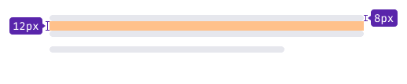
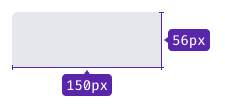
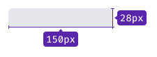
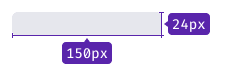
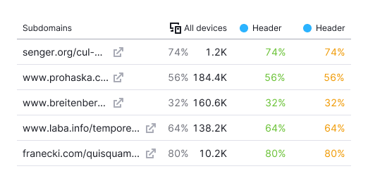
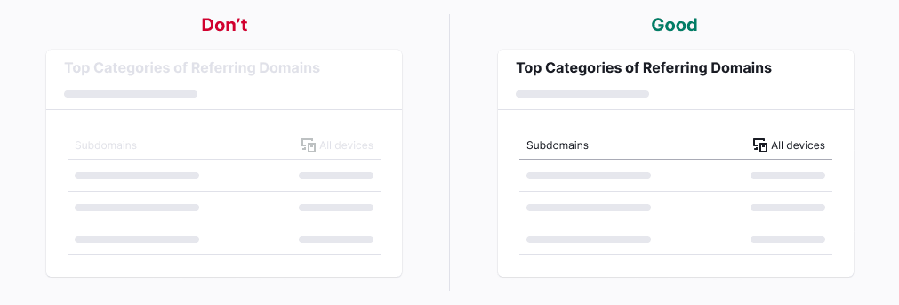
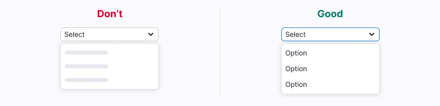

## Description

**Skeleton** is a component used to display the structure of a widget or page when it's initially loading.
Its purpose is to provide users with a mental map of the data being loaded.

::: tip
This component demonstrates the loading and response to user actions in the interface.
:::
For general recommendations regarding such components, refer to the [Loading patterns](/patterns/loading-states/loading-states).

**Use Skeleton for the following cases**

- The content takes 0 to 5 seconds to load. If it takes longer, combine it with the [ProgressBar](/components/progress-bar/progress-bar).
- The number and approximate layout of elements are known in advance.
- When displaying dynamic information during initial loading: pages, widgets, complex components such as tables, charts, or selects.

Multiple skeletons can be shown simultaneously or asynchronously during the initial loading of elements.

::: tip
It isn't recommended to use Skeleton for pages that are indexed by Google such as blog pages.
:::

## Themes

Skeleton has two themes—`dark` and `invert`–for using on light and dark/colored backgrounds, respectively. All skeleton “bones” have a `border-radius` of 4px.

Table: Skeleton themes

| Theme  | Appearance example                     | Styles                                    |
| ------ | -------------------------------------- | ----------------------------------------- |
| Dark   |  | `background: var(--skeleton-bg)`.        |
| Invert |    | `background: var(--skeleton-bg-invert)`. |

## Animation

The Skeleton is animated with a content appearance animation lasting 300 ms with an `ease-out` effect (refer to [Code examples](/components/skeleton/skeleton-code)).
The Skeleton gradient animation has a default duration of 2000 ms.
Animation is applied per data block (widgets, tables, charts) without the need for synchronization between elements.

::: tip
If you don't need animation in the Skeleton, you can stop the animation using the `duration="0"` property.
:::

## What should be skeletonized

The information on the page can be divided into 2 categories:

- Static information (doesn't need Skeleton).
- Dynamic information (needs Skeleton).

### Static information (doesn't need Skeleton)

- Text, data, and components that don't depend on user actions and product settings.
- Product name.
- Widget titles and tooltips.
- Table headers.
- Components for actions such as buttons, inputs, toggles, and pills.

These components don't require additional loading and can be displayed immediately.

### Dynamic information (should be skeletonized)

This information requires additional requests and a long time to load.
It varies depending on the user's actions and specific projects.
In most cases, this group includes:

- Widgets
- Tables
- Charts
- Project statistics
- Selects

### Components that should never be skeletonized

Additionally, the following components should never use Skeleton—they should be loaded by the time the user interacts with them:

- [NoticeBubble](/components/notice-bubble/notice-bubble).
- [Dropdown](/components/dropdown/dropdown) (selects and dropdowns are loaded immediately. However, if the dropdown contains a table with data, you can use a skeleton for it).
- [Tooltip](/components/tooltip/tooltip).
- [Modal](/components/modal/modal).
- [Spin](/components/spin/spin).

## Text skeleton

### Paragraph

Replace any paragraph with a single type of Skeleton.

- We recommend showing no more than three "bones."
- The width of the "bones" should match the width of the paragraph, but not exceed 600px.
- The length of the last "bone" should be 3/4 of the previous two "bones."

### Headers

Each header is replaced by a "bone" with a height equal to the header's line-height.

- The header is always replaced by a single line of the skeleton "bone," even if it spans two lines.
- The width of the "bones" is set to 150px, and it can be increased in rare cases if necessary.

Table: Skeleton appearance for all heading levels

| Heading level   | Appearance example    |
| --------------- | --------------------- |
| h1              |     |
| h2-h3           |  |
| h4              |     |
| h5-h6           |  |

## Image skeleton

### Illustrations

The Skeleton for illustrations depends on their size:

- For small-sized illustrations like user pictures or advertising previews, show a skeleton "bone" corresponding to the illustration size, and immediately replace it with the actual illustration upon loading.

Table: Skeleton for small illustrations

| Step                                 | Appearance example        |
| ------------------------------------ | ------------------------- |
| 1. Initial loading                   |       |
| 2. Replace by illustrations and text |  |

- For large-sized illustrations like screenshots on landings or blog pictures, consider using a multi-step loading process. Show small pictures and the Skeleton initially, replace them with text and user pictures, and then load the large image blurred before fully loading it.

Table: Skeleton for large illustrations

| Step                        | Appearance example                |
| --------------------------- | --------------------------------- |
| 1. Initial loading          |       |
| 2. Small illustrations and skeleton are replaced by text and user picture, the large one is loaded blurred |  |
| 3. Big illustrations is fully loaded     |   |

### Icons

In most cases, avoid using a Skeleton for icons. Either hide them or leave them in a `disabled` state. If needed, a skeleton "bone" for an icon should match the icon's size, and there should be a multiple of 4 margin between multiple icons.

## Chart skeleton

For charts, avoid showing axes and labels. Replace the legend with a Skeleton, and refer to [Chart principles](/data-display/d3-chart/d3-chart) for more detailed guidelines.

## Button and link skeletons

- If a button or link takes the user to another page, leave them as is during the initial loading of the page/widget.
- If a button or link submits data or confirms user actions, set them to a `disabled` state while loading.

::: tip
When you don’t know what type of button (`primary` or `secondary`) should be loaded, show Skeleton instead of the button.
:::

## Skeleton in complex components

### Table

**Primary tables**

- Replace text and links with Skeleton.
- Disable row controls during the initial loading of the table.
- Keep the table header and sorting active during the initial loading of the table.

**Secondary tables**

- Replace text and links with Skeleton.
- Keep the header active during the initial loading of the table.
- For widgets with a maximum of five text rows, show all of them.

### Chart

- Keep pills active during the initial loading of the table.
- Replace the legend with skeleton "bones" of the same size.
If the legend values are known in advance, show them during the initial loading.
- Replace the chart with the corresponding Skeleton based on the chart type.
For more details, refer to [Chart principles](/data-display/d3-chart/d3-chart).

### Summary

- Avoid showing trends, additional information, and links during initial loading.
- Keep `Info` icons active during initial loading.
- Replace icons inside the Summary with Skeleton "bones" of the same size.
- Replace the values with Skeleton "bones" matching the size of the value's line-height.

### Pills

Pills should never be disabled. They should always remain active, even during the initial loading, to let users navigate to their desired tabs.

**Pills with counters**

During the initial loading of the page, the counters in the pills can be displayed as skeletons.
For more information about page loading, refer to [Web-performance](/patterns/web-performance/web-performance).

**Big pills**

Skeletonize big pills similarly to the Summary.

- Avoid showing trends, additional information, and links during initial loading.
- Replace the values with skeleton "bones" matching the size of the value's line-height.

## Usage in UX/UI

**Use Skeleton only for displaying dynamic information.**
Information that can be shown instantly and remains unchanged should be displayed immediately.

**Static information should be shown immediately.** It shouldn't be disabled.

**Use Skeleton to display changing page titles**—for example,
the project name or widget title that depends on certain factors.

**Show only the main information** and avoid showing unnecessary additional details
during the initial loading of the page.

**Avoid displaying icons separately from the text or links they belong to.**
The exception is for icons that represent critical information.

**Buttons and checkboxes need to be disabled during the initial loading of the table.**

**Show `Info` icons and tooltips** so that users can read loading information
during the initial loading.

**Show dropdowns and selects immediately during initial loading.**

**Don’t add too many skeleton "bones."** Add no more than three.
Otherwise, you'll increase the page load time excessively.

