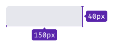
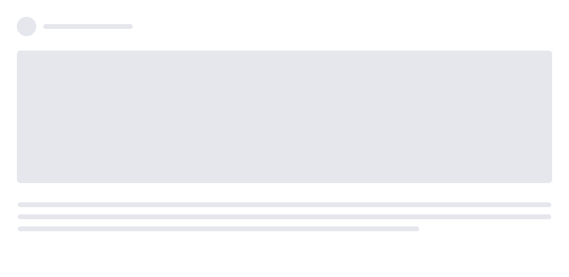
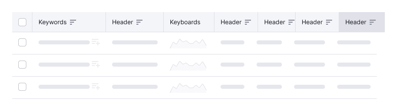
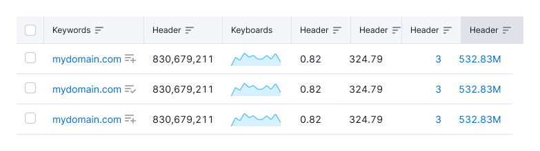
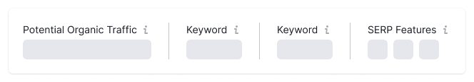
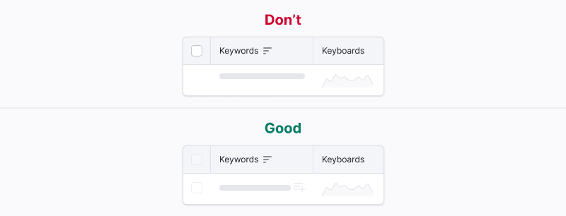
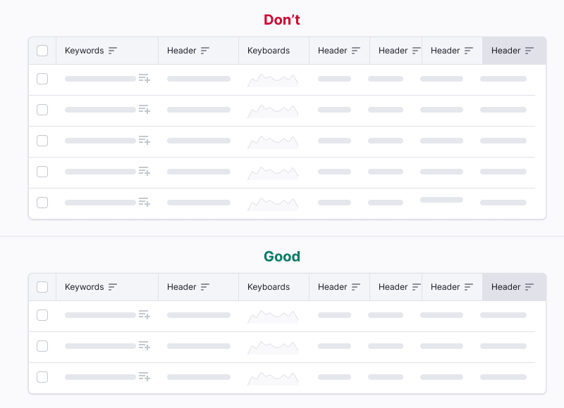

@## Description

> 💡 This component is one of the components that displays interface's reaction to user actions in the interface. For general rules on such components, see the [Loading patterns](/patterns/loading-states/).

**Skeleton** is a component for displaying the structure of a widget and/or a page during their initial loading. Skeleton is needed to form user's mental map about the data being loaded.

### When to use Skeleton

- If the content is loading from 0 to 5 seconds. If it takes more time, use it in combination with [ProgressBar](/components/progress-bar/).
- When the number and approximate layout of elements are known in advance.

Several skeletons can be shown simultaneously or asynchronously while initial loading of the elements.

@## Themes

Skeleton has [two themes](/components/skeleton/skeleton-api/): `dark` and `invert` — for using on light and dark/colored backgrounds, respectively.

All skeleton “bones” have `border-radius` of 4px.

| Theme  | Appearance example                     | Styles                              |
| ------ | -------------------------------------- | ----------------------------------- |
| dark   |  | `background: var(--gray-100, 0.8)`. |
| invert |    | `background: var(--white, 0.3)`.    |

@## Animation

Our Skeleton is animated. You can see the live skeleton animation in the [Code](/components/skeleton/skeleton-code) tab.

Animation is added per data block (widgets, tables, charts). There is no need to synchronize it between different elements/widgets, as it may affect the page loading time.

Content appearance animation is 300ms with `ease-out`. Skeleton gradient animation has 2000ms duration by default.

> 💡 In case you do not need animation in the Skeleton, you can stop the animation using the property `duration="0"` 🕺🏻

@## How to skeleton different components and elements on a page?

### Paragraph

Any paragraph should be replaced by one type of skeleton.

- Show three "bones".
- The width of "bones" is equal to the width of the paragraph, but no more than 600px.
- The length of the last "bone" is 3/4 of the previous two "bones".

### Headers

Each header is replaced by a "bone" with the height equal to the header's line-height.

- The header is always replaced by the one line of the Skeleton "bone", even if the header consists of two lines.
- The width of "bones" is 150px. In rare cases, you can increase it, if it is necessary.

| h#    | Appearance                       |
| ----- | -------------------------------- |
| h1    |     |
| h2-h3 |  |
| h4    |     |
| h5-h6 |  |
| h7    |     |

### Images

Skeleton of images depends on their size:

- Images of small size: user pictures, preview of advertising.
- Images of big size: big screenshots on the landings, pictures in the blog and instructions.

**Images of small size** are shown by the Skeleton “bone” corresponding to the image size, and are immediately replaced by the real image at loading.

| Step                            | Example                                |
| ------------------------------- | -------------------------------------- |
| 1. Skeleton                     |       |
| 2. Replace by pictures and text |  |

**Images of big size** are shown as follows:

> 💡 In cases when it is possible from the technical point of view, skip the first step of the next scheme for large images.

| Step                                                                                                  | Пример                                        |
| ----------------------------------------------------------------------------------------------------- | --------------------------------------------- |
| 1. Skeleton                                                                                           |       |
| 2. Small pictures and skeleton are replaced by text and user picture, the large one is loaded blurred |  |
| 3. Big picture is loaded fully                                                                        |   |

### Icons

In most cases, do not skeleton the icons. Either do not show them or leave them in the `disabled` state.

If it's necessary to show a Skeleton "bone" instead of an icon, the size of "bone" should be equal to the size of the icon. If there are several icons, the distance between them should be a multiple of 4.

### Charts

General recommendations:

- Do not show axes and labels.
- Replace legend with Skeleton.

For a detailed guide, see the [Chart principles](/data-display/chart/).

### Buttons and links

| Case                                                      | Description                                                                   |
| --------------------------------------------------------- | ----------------------------------------------------------------------------- |
| 1. Buttons or link takes the user to another page.        | While initial loading of the page/widget, leave such buttons and links as is. |
| 2. Buttons or link submits data or confirm user's action. | When loading such controls, **set such buttons and links to disabled state**. |

> 💡 When you do not know what type (primary or secondary) of the button should be loaded (depends on different extreme cases of UX script), skeleton the button.

@## When to use

Skeleton shows the structure of the page/component as long as it is loaded so that the user has a mental model of the loaded information. In other words, it is a simplified page view. Therefore, it is not recommended to skeleton every component on the page.

Skeleton is recommended for using while/when:

- initial loading;
- the whole page is loading;
- complex component is loading.

> 💡 It is not recommended to use Skeleton for pages that are indexed by Google (for example, blog pages).

@## Loaded data

Data is more important than skeletons, animations and everything else. As soon as it is possible to show data, show it.

- Data of widgets can be loaded asynchronously and not in sequence. The main thing is that the content of the widget is loaded simultaneously.
- It is better to load the data in tables either at once or sequentially so that the lines do not change their places.
- In some cases, it is better to load data in groups: panel summary group, select group, etc.

> 💡 If the loading takes more than 5 seconds, but it is necessary to show the already loaded data, it is recommended to use Skeleton paired with the [ProgressBar](/components/progress-bar/).

@## What should be skeletonized?

The information on the page can be divided into 2 categories:

- static information (does not need Skeleton);
- dynamic information (need Skeleton).

### Static information (does not need Skeleton)

- Text, data and components that do not depend on user actions and tool settings.
- Product name.
- Widget titles, tips.
- Table headers.
- Components of the action, which are buttons, inputs, toggles and pills.

These components do not require additional loading and can be displayed immediately.

### Dynamic information (should be skeletonized)

This information requires additional request and a long time to load. It varies depending on the user's actions and specific projects. In most cases, this group includes:

- widgets;
- tables;
- charts, project statistics;
- selects.

In addition, the following components should never use Skeleton, as they should be loaded by the time the user interacts with them:

- [NoticeBubble](/components/notice-bubble/);
- [Dropdown](/components/dropdown/) (selects and dropdowns are loaded immediately. However, if the dropdown contains a table with data, you can skeleton it);
- [Tooltip](/components/tooltip/);
- [Modal](/components/modal/);
- [Spin](/components/spin/).

@## Use in different components

### Table

#### Primary tables

- Replace text and links with Skeleton.
- Row controls are recommended to be disabled while initial loading of the table.
- Table header and sorting should be active while initial loading of the table.

#### Secondary tables

- Replace text and links with Skeleton.
- The header should be active while initial loading of the table.
- In widgets, where the maximum number of lines is 5, show them all.

### Chart

- Pills should be active while initial loading of the table.
- The legend is replaced by Skeleton “bones" of the same size. But if the legend values are known in advance, show it while initial loading.
- The chart is replaced with the Skeleton corresponding to the chart type. See more in [Chart principles](/data-display/chart/).

### Summary

- Do not show trends, information and additional links.
- Info icons should be active while initial loading.
- Icons inside the PanelSummary are replaced with Skeleton “bones" with the same size.
- The values are replaced with Skeleton “bones" with the size of value's line-height.

### Pills

Pills are never disabled. They are always active (even while initial loading) so the user can navigate to the tab he needs.

#### Pills with a number

At the initial loading of the page, the counters in the pills can be skeletonized. For more information about the page loading, see [Web-performance](/patterns/web-performance/) 🙌🏻

#### Big Pills

Skeletonize them same way as Summury.

- Do not show trends, information and additional links.
- The values are replaced with Skeleton “bones" with the size of value's line-height.

@## Use in UX/UI

**Use Skeleton only for displaying dynamic information.** Information that can be shown at once and will not change should be shown immediately.

Static information should be shown immediately. **It should not be disabled**.

**Use Skeleton to display the changing page titles**. For example, for the project name or widget title that depends on something.

**Skeleton only main information**, and do not at all additional information. _For example, do not show trends and tags while initial loading of the page._

**Do not skeleton icons separately from the text or links they belong to**. The exception is for the icons which represents main infromation.

**Buttons, checkboxes need to be disabled while initial loading of the table.**

**Show Info icons and tooltips.** So during the initial loading, the user will be able to read the information about the loading data.

Show dropdowns and selects immediately while initial loading.

**Do not add to much Skeleton "bones".** Add no more than three. Otherwise you'll increase the page load time.

> 💡 This component is one of the components that displays interface's reaction to user actions in the interface. For general rules on such components, see the [Loading patterns](/patterns/loading-states/).

@page skeleton-api
@page skeleton-code
@page skeleton-changelog
