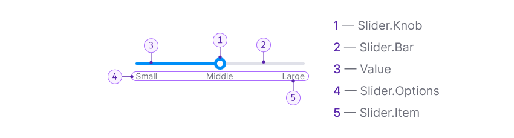

## Description

**Slider** is a component designed for choosing values within a specified range.

According to [Nielsen Norman Group](https://www.nngroup.com/articles/sliders-knobs/),
a slider with a wide range of values offers a smoother and continuous control experience for the user
compared to controls with only a few fixed options.

**Use it when:**

- You need to visualize a range from which the user can select an approximate value.
- You want to visualize the maximum range of a usual [InputNumber](/components/input-number/input-number).
- The user needs to specify an approximate value, such as adjusting color brightness.

## Component composition

The Slider component consists of the following:

- `Slider.Knob`
- `Slider.Bar`
- Value
- (Optional) `Slider.Options` with `Slider.Item` inside.

::: tip
When designing this type of input, consider the [Akkot-Tsai law](https://en.wikipedia.org/wiki/Steering_law),
which describes how the time taken to perform an action depends on the thickness and width of the horizontal control used for that action.
Larger slider knobs and bars make using sliders easier and faster.
:::

## Appearance

### Sizes

Default component sizes:

- Bar height: 4px
- Knob size: 20px * 20px

### Styles

Default component styles:

- Bar color: `--progress-bar-bg`
- Progress and knob color: `--control-primary-info`

## Value labels

You can display values under the input.

::: tip
For mobile devices, display values or tooltips with values above the input.
On touch devices, the values should appear above the finger while manipulating the slider knob.
:::

## Interaction

### States

Table: Slider states

| State        | Description         | Appearance example         |
| ------------ | ------------------- | -------------------------- |
| Default      | Knob size is `20px * 20px`.        |       |
| Hover        | The color of the bar changes to `--progress-bar-bg-hover`. The slider knob changes color to `--control-primary-info-hover`. The cursor changes to `pointer`. |   |
| Active/Focus | The slider knob scales to `30px * 30px`. Clicking anywhere on the bar pulls up the slider and sets it to the `active` state.   |       |

### Linked input

The easiest way to avoid invalid values is to provide an input alongside the slider,
letting users enter the exact value.

This design reduces errors associated with switching between mouse and keyboard.
Ensure that keyboard shortcuts can still be used when the input is focused.

- If the user enters a value through the associated input,
the hover effect is not applied to the slider.
The slider knob moves according to the value entered in the input.

Table: Slider with linked input in active state

| State        | Description          | Appearance example   |
| ------------ | -------------------- | -------------------- |
| Active/Focus | Clicking on the input pulls the slider knob to the corresponding value and sets it to the `active` state. |  |

- If the input has a maximum value, and the user enters a value greater than the maximum,
show a warning tooltip with an appropriate message.

## Usage in UX/UI

### When to use slider

This input works best when the user doesn't need to enter a specific value
but wants to choose an approximate value.

As shown in the earlier example, changing color brightness or volume
are the main use cases for the slider component.

### Usage on mobile devices

Consider the context of the interface.
Clicking and dragging a control to an exact location on mobile devices can be challenging.
Many users accidentally move the slider knob off the value they were trying to select
when lifting their finger off the screen, [as mentioned by Nielsen Norman Group](https://www.nngroup.com/articles/sliders-knobs/).

### Input values location

Consider how users will interact with the control.
Avoid placing value labels under the input on mobile devices,
as this may obscure them when users interact with the control.

To ensure the labels remain visible during interaction,
place them either to the left/right or above the slider.

