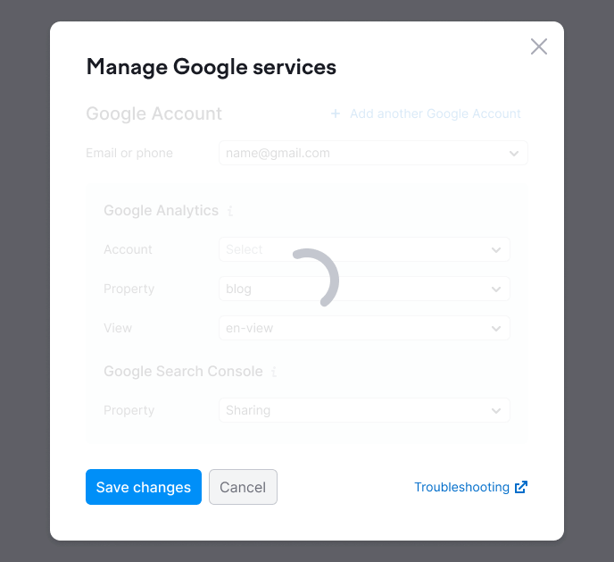

@import playground

@## Description

**SpinContainer** is a component for displaying [Spin](/components/spin/) around a component/widget/page.

@## Appearance

- Spin is always placed in the center of the SpinContainer.
- SpinContainer has overlay with transparency of 0.85.

@## Fixed Spin

For big blocks, widgets and pages, you can wrap Spin in [Sticky](/components/sticky/) component, so the loading message can be always seen in the user's viewport.

@page spin-container-api
@page spin-container-code
@page spin-container-changelog
