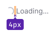

@import playground

@## Description

> 💡 This component is one of the components that displays the download and response to user actions in the interface. For general recommendations on such components, see the [Loading patterns](/patterns/loading-states/).

**Spin** is a component of the page, section or individual widget loading status for those cases when we do not know the exact time of data loading. To display it around any component, use [SpinContainer](/components/spin-container/).

@## Animation

Animation of spinner appearance and disappearance is performed with `300 ms ease-out`.

@## Sizes and indents

> For recommendations on spinners positioning and indents in blocks and on the page, see the [SpinContainer](/components/spin-container/).

We use six sizes of spinners in our interface.

The text, which tells the user that part of the content is being loaded, may stand next to the spinner. The color of the text should be `--gray-500` because it is a secondary explanatory text (for main and secondary colors see our [Typography](/style/typography).

**The text can be placed both on the right and under the spinner**.

It is logical to place the explanatory text to the right of the spinner in small components, blocks and widgets.

If a spinner with text is placed in a large component, around a block of components or inside large blocks and widgets, it is recommended to place the explanatory text below it and use one of the four large spinner sizes.

> 💡 **The size of the spinner text should be at least 14px.** Take care of the vision sense of our users 🙏

| Size    | Text below                                  | Text on the right                            |
| ------- | ------------------------------------------- | -------------------------------------------- |
| **XXL** |  |  |
| **XL**  |    |    |
| **L**   |      |      |
| **M**   |      |      |
| **S**   |      |      |
| **XS**  |    |     |

@## Themes

The component has two themes — `dark` and `invert`. Custom colored spinners are used only inside the secondary and third-rate buttons.

### Dark

 — is used with a light background.

### Invert

 - is used with a dark/colored background.

@## Use in UX/UI

Remember that the page progress indicator should help the user to estimate the interface response time, i.e. how long he should wait for a certain result. Therefore, in cases where you don't know exactly how long it will take to load or it will be very long, it is recommended to add explanatory text to a spin, for example: **Loading...** etc.

> 💡 This component is one of the components that displays the loading and response to user actions in the interface. For general recommendations on such components, see the [Loading patterns](/patterns/loading-states/).

@page spin-api
@page spin-changelog
