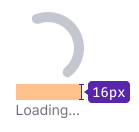
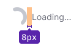
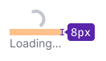
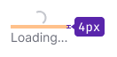

@import playground

> This component is one of the components that displays interface's reaction to user actions in the interface. For general rules on such components, see the [Loading patterns](/patterns/loading-states/).

@## Description

**Spin** is a component for displaying the loading status of the page, section or widget when system does not know the exact time of data loading.

For displaying Spin around any component, use [SpinContainer](/components/spin-container/).

@## Sizes

We have six sizes of Spin.

> **The size of the text should be at least 14px.**

| Size    | Text below                                  | Text on the right                            |
| ------- | ------------------------------------------- | -------------------------------------------- |
| **XXL** |  |  |
| **XL**  |    |    |
| **L**   |      |      |
| **M**   |      |      |
| **S**   |      |      |
| **XS**  |    |     |

@## Styles

> For recommendations on Spin positioning and indents in blocks and on the page, see [SpinContainer](/components/spin-container/).

You can place text, which tells user that data is being loaded, next to the spinner. Text should have `--gray-500` color, because it is a secondary message according to the whole visual hierarchy of the page.

**Text can be placed on the right or under the spinner**. Place the text to the right of the spinner in small components, blocks and widgets. If Spin with text is placed in a large component, around a block of components or inside large blocks and widgets, we recommended you to place the text below the spinner and use one of the four biggest Spin sizes.

@## Themes

Spin has two themes: `dark` and `invert` — for using on light and dark/colored backgrounds, respectively. You also can make your Spin colored in a custom color if needed.

| Theme  | Appearance example                   | Description                                            |
| ------ | ------------------------------------ | ------------------------------------------------------ |
| Dark   |     | Use Spin with this theme on a light background.        |
| Invert |  | Use Spin with this theme on a dark/colored background. |

@## Animation

For Spin appearance and disappearance use animation with 300ms delay and `ease-out`.

@## Use in UX/UI

Remember that the page loading indicator should help user to estimate the interface's response time (i.e. how long he should wait for a certain result). Therefore, in cases when system does not know exactly how long it will take to load data, we recommend you to add explanatory message next to a spinner, for example: **Loading...**.

> This component is one of the components that displays interface's reaction to user actions in the interface. For general rules on such components, see the [Loading patterns](/patterns/loading-states/).

@page spin-api
@page spin-changelog
