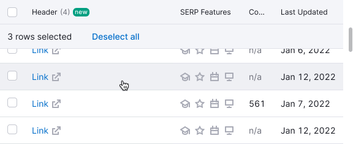
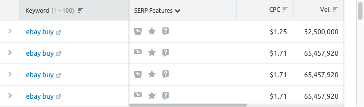
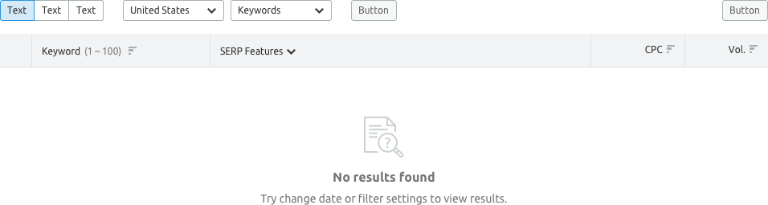
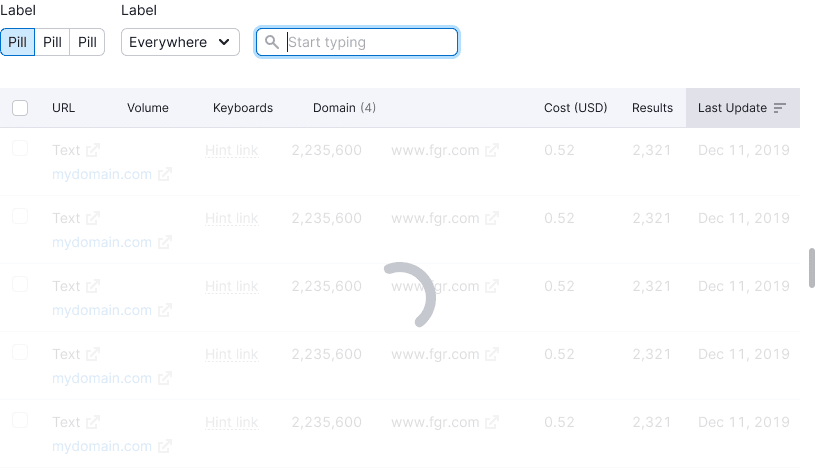
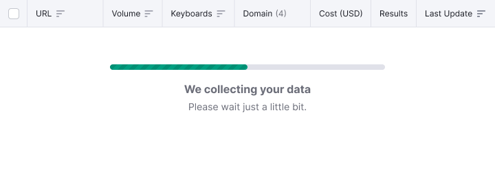
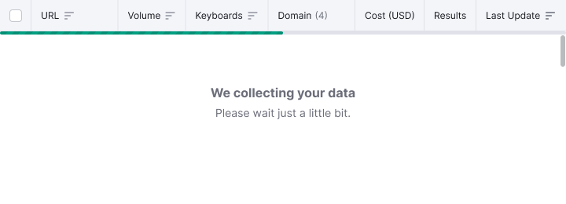
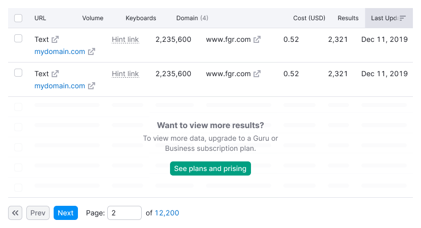

@## Description

**Sticky** is a component that can be used to "pin" a block towards a parent one when scrolling.

The block can either be centered in relation to the height and width of the parent block or pinned with a certain indent on the top, bottom, left and right sides of the block.

> 💡 "Pinned" messages allow the user not to lose sight of important messages about loading, data collection, limit on viewing and errors in work with data when scrolling a page.

@example limit

@## Pin of a header and columns in a table

When scrolling a table its header should be pinned. At the same time, it does not have any shadows.

If there is a status bar or a line with quick steps for a table under the header, it is "pinned" under the header.

In some cases, it is necessary to "pin" the first one or two columns in the table. At the same, they should always have a shadow when scrolling, so that the user can see that there is content under them.

The style of the shadow is `background-image: linear-gradient(to left, rgba(0, 0, 0, 0.1), rgba(255, 255, 255, 0));`.

@## Pin of messages inside the block

Inside the blocks, messages that are scrolled must be "pinned" towards the vertical and horizontal center of the parent block.

@## Pin of the progress bar

We can “pin” the [ProgressBar](/components/progress-bar/) to the top of the page or to any other block “pinned” above it (for example, to the table header).

@## Pin of the content in blocks with limits

If a limit appears in the block (an overlay overlaps the block), the message about it should be centered towards the block at scrolling.

@page sticky-api
@page sticky-changelog
