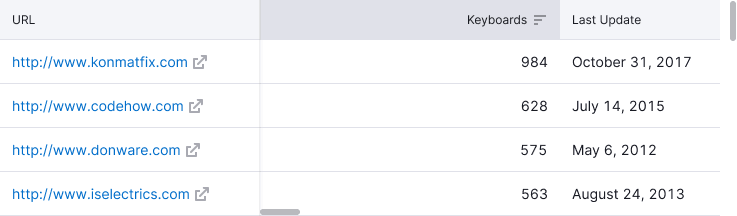
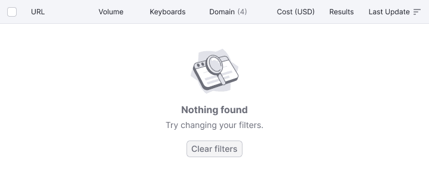

@## Description

**Sticky** is a component that can be used to pin a block towards a parent one when scrolling.

The block can either be centered in relation to the height and width of the parent block or pinned with a certain margin the top, bottom, left and right sides of the parent block.

> 💡 Pinned messages allow user not to lose important messages about loading, data collection, limitations on viewing and errors in working with data when scrolling a page.

@example limit

@## Pinning of header and columns in table

When scrolling a table, pin its header. Do not add have any shadows to pinned table header.

If there is a status bar or a table row with quick actions, then pin them under the table header.


In some cases, it is necessary to pin the first one or two columns in the table. Do not forget to add shadows to then when scrolling, so that the user can see that there is more content.

Shadow has the following styles:

```
background-image: linear-gradient(to left, rgba(25, 27, 35, .1), rgba(255, 255, 255, 0));
```



@## Pinning of messages inside the block

Inside the big blocks and widgets, you can pin messages towards the vertical and horizontal center of the big parent block.




@## Pinning of ProgressBar

You can pin [ProgressBar](/components/progress-bar/) to the top of the page or to any other block pinned above it (for example, to the table header).


@## Pinning of the content in blocks with limits

If a limit message appears in the block, center this message towards its parent block while scrolling.


@page sticky-api
@page sticky-changelog
