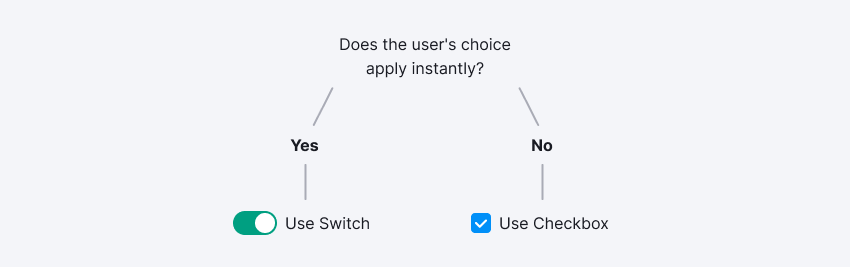
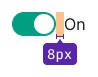
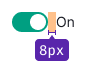
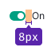
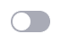
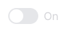
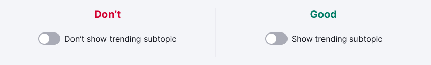

@import playground

@## Description

**Switch** is a control for instant switching of a certain option/state/function.

It should be used in cases when on/off should occur instantly, without reloading the page and clicking the confirmation button.

@## Sizes and margins

Our interface uses three switch sizes, which are xl, l and m. You can sign either one or both of the switch states with the label. At the same time, the enabled option always has the main color `$gray20`, and the disabled option has the secondary color `$gray60`.

|     | Appearance and margins                     | Styles                                                                         |
| --- | ------------------------------------------ | ------------------------------------------------------------------------------ |
| XL  |  | `width: 44px; height: 24px; circle: 20px; font-size: 16px; font-padding: 8px;` |
| L   |    | `width: 32px; height: 18px; circle: 14px; font-size: 14px; font-padding: 8px;` |
| M   |    | `width: 20px; height: 12px; circle: 8px; font-size: 12px; font-padding: 8px;`  |

@## Themes

The Switch component has two themes, which are `info` and `success`. Themes affect the component display in the `checked` state.

| Theme   | Usage                                                                                           |
| ------- | ----------------------------------------------------------------------------------------------- |
| Info    | Default color of the enabled switch state that is suitable for most common actions.             |
| Success | Additional color for cases when you want to emphasize the enabled positive state of the switch. |

> 💡 When the switch is used to enable/disable a social network account, you can use the appropriate brand color for the `active` state.

@## Icon

An icon can be placed inside the two large switch sizes. It is recommended to use different icons for off and on states for greater state differentiation.

For example, it is possible to use `ShowNo` and `ShowYes` icons inside the switches.

@## Interaction

The switch can be in one of three main states: off, on, and disabled. To change the state, click either on the switch or on the text next to it.

| State    | Appearance                                                                            | Styles                                                   |
| -------- | ------------------------------------------------------------------------------------- | -------------------------------------------------------- |
| off      |                                                          | `background: rgba(0, 0, 0, 0.4);`                        |
| on       |                      | `background:$green` или `background: $light-blue`        |
| disabled |   | The transparency of the entire component changes by 30%. |

@## Use in UX/UI

**Use positive language for switch labels** to make it clear what the interface will do if the user puts the toggle on.

Avoid negations such as **“Don't show trending subtopics”**, which would mean that the user would have to check the box so that something is not shown.

Use the verb in the label of the switch. _For example, "Send by email"._

You can use a label without a verb in cases when:

- space is limited, therefore, a shorter option is needed (of course, not for clarity);
- when the label belongs to a group of switches (for example, in the settings).

@page switch-api
@page switch-changelog
