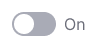

@import playground

@## Description

**Switch** is a control for instant switching between two options, states or functions.

Use it in cases when boolean operation submits user's choice instantly, without reloading the page and clicking the confirm button.

@## Sizes and margins

Our switch has three sizes: xl, l and m.

You also can add a text label to switch input. The text of enabled option has `--gray-800` color, and the text of disabled option has `--gray-500` color.

|     | Appearance and margins                     | Styles                                                                         |
| --- | ------------------------------------------ | ------------------------------------------------------------------------------ |
| XL  |  | `width: 44px; height: 24px; circle: 20px; font-size: 16px; font-padding: 8px;` |
| L   |    | `width: 36px; height: 20px; circle: 16px; font-size: 14px; font-padding: 8px;` |
| M   |    | `width: 20px; height: 12px; circle: 8px; font-size: 12px; font-padding: 8px;`  |

@## Themes

Switch component has two themes: `info` and `success`.

| Theme   | Appearance example                            | Usage                                                                                                 |
| ------- | --------------------------------------------- | ----------------------------------------------------------------------------------------------------- |
| Info    |  | Default theme for most common actions.                                                                |
| Success |  | Additional theme for cases when it;s necessary to emphasize the enabled positive state of the switch. |

> When the switch is used to enable/disable a social network account, you can use the appropriate brand color for the `active` state.

@## Icon

You can place an icon inside the switch with big sizes. We recommend you to use different icons for off and on states.

| Swith size | Off state                             | On state                            |
| ---------- | ------------------------------------- | ----------------------------------- |
| XL         |  |  |
| L          |   |   |

@## Interaction

Switch has three possible states: off, on, and disabled. To change the state, user can click either on the switch itself or on the text label next to it.

| State    | Appearance                                                                              | Styles                                                                                                            |
| -------- | --------------------------------------------------------------------------------------- | ----------------------------------------------------------------------------------------------------------------- |
| off      |                                                            | `background:--gray-300`                                                                                           |
| on       |                      | `background:--green-400` или `background: --blue-400`                                                             |
| disabled |   | Transparency of the component changes to 30%. Use [`disabled` variable](/style/variables/#disabled_x26_loading/). |

@## Use in UX/UI

**Use positive language for text labels in the Switch** to make it clear what interface will do if user enables the toggle.

Avoid negations such as: “Don't show trending subtopics”, — which would mean that the user would have to enable the switch so something will not be shown.

> Use verbs for the labels. _For example, "Send by email"._

You can use a label without a verb in cases when:

- you have not enough space in the interface;
- when the label belongs to a group of switches (for example, in the settings).

@page switch-a11y
@page switch-api
@page switch-code
@page switch-changelog
