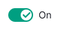
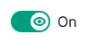

::: react-view

:::

## Description

**Switch** is a component that enables users to easily switch between two options or states without needing to refresh the page or confirm their choice.

## Component composition

Component consists of the following:

- `Switch.Value`
- `Switch.Addon`

## Sizes and margins

The switch comes in three sizes: `m`, `l` and `xl`.

The switch includes a text label, which can be added to one or both of the states. When the option is enabled, the text color uses the `--text-primary` token, and when the option is disabled, the text color uses the `--text-secondary` token.

Table: Switch sizes and styles

| Switch size (height in px) | Appearance example and margins   | Styles       |
| -------------------------- | -------------------------------- | ------------ |
| M (12px)   |     | `font-size: var(--fs-100)`, margin between the control and the text is 8px  |
| L (20px)   |     | `font-size: var(--fs-200)`, margin between the control and the text is 8px |
| XL (24px)  |   | `font-size: var(--fs-300)`, margin between the control and the text is 8px |

## Themes

The Switch component offers two themes: `info` and `success`.

Table: Switch themes

| Theme     | Appearance example         | Usage                       |
| --------- | -------------------------- | --------------------------- |
| `info`    |     | Default theme.              |
| `success` |  | Theme for highlighting a positive enabled state of the switch. |

## Icon inside Switch.Value

For larger sizes of the component (`l` and `xl`), you have the option to include an icon within the `Switch.Value`. It is recommended to use different icons for the off and on states.

Table: Icon inside the Switch.Value

| Switch size | Normal state                       | Checked state                     |
| ----------- | ---------------------------------- | --------------------------------- |
| l           |   |   |
| xl          |  |  |

## Interaction

Table: Switch states

| State   | Appearance example      | Styles        |
| ------- | ----------------------- | ------------- |
| Normal   |      | `background: var(--control-switch-bg)`   |
| Checked |      | `background: var(--control-primary-success)` or `background: var(--control-primary-info)`.           |
| Disabled |   | Transparency of the component changes to 30%. Use [`--disabled-opacity`](/style/design-tokens/design-tokens) token. |

## Usage in UX/UI

For clear actions when using the toggle, **use positive language for text labels in the Switch.** Avoid negations like "Don't show trending subtopics," as they can cause confusion about the switch's effect. Instead, use language that clearly indicates what the switch does, such as "Show trending subtopics."

When making labels, use action verbs like "Send by email" to clearly indicate the switch's purpose.

But, in cases with limited interface space or when the label is part of a switch group (specifically in settings), it's okay to use labels without verbs.

