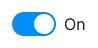
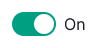
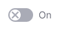
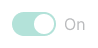

@import playground

@## Description

**Switch** is a component that allows user to quickly switch between two options, states, or functions.

It is useful when you want the user's choice to take effect immediately, without having to refresh the page or click a confirmation button.

@## Sizes and margins

The switch has three sizes.

The switch also includes a text label, which can be added to one or both of the states. When the option is enabled, the text color uses the `--text-primary` token, and when the option is disabled, the text color uses the `--text-secondary` token.

@table-caption Switch sizes and styles

| Switch size (height in px) | Appearance example and margins   | Styles       |
| -------------------------- | ------------------------ | ------------ |
| M (12px)   |     | `width: 20px`, `height: 12px`, circle size is 8px, `font-size: var(--fs-100)`, margin between the control and the text is 8px.  |
| L (20px)   |     | `width: 36px`, `height: 20px`, circle size is 16px, `font-size: var(--fs-200)`, margin between the control and the text is 8px. |
| XL (24px)  |   | `width: 44px`, `height: 24px`, circle size is 20px, `font-size: var(--fs-300)`, margin between the control and the text is 8px. |

@## Themes

Switch component has two themes: `info` and `success`.

@table-caption Switch themes

| Theme   | Appearance example         | Usage                       |
| ------- | -------------------------- | --------------------------- |
| Info    |     | Default theme.              |
| Success |  | Theme for highlighting the positive enabled state of the switch. |

@## Icon inside the Switch.Value

With larger sizes of the component (l, xl), you have the option to include an icon within the `Switch.Value`. It is recommended to use different icons for the off and on states.

@table-caption Icon inside the Switch.Value

| Switch size | Normal state                       | Checked state                     |
| ----------- | ---------------------------------- | --------------------------------- |
| L           |   |   |
| XL          |  |  |

@## Interaction

@table-caption Switch states

| State   | Appearance example              | Styles        |
| ------- | ----------------------- | ---------------------------------------- |
| Normal   |      | `background: var(--control-switch-bg)`   |
| Checked |      | `background: var(--control-primary-success)` or `background: var(--control-primary-info)`.           |
| Disabled |   | Transparency of the component changes to 30%. Use [`--disabled-opacity`](/style/design-tokens/) token. |

@## Usage in UX/UI

To ensure clarity about the actions performed when the user enables the toggle, **it is recommended to use positive language for text labels in the Switch.**

Avoid negations like "Don't show trending subtopics," as they may create confusion about whether enabling the switch hides or shows something.

When creating labels, use verbs to indicate actions, such as "Send by email".

However, in cases where there is limited space in the interface or when the label belongs to a group of switches (e.g., in settings), it is acceptable to use a label without a verb.

@page switch-a11y
@page switch-api
@page switch-code
@page switch-changelog
