<Playground for="TabLine" />

## Description

**TabLine** is a component for navigating inside a report and grouping homogeneous content in the interface.

**Don't use this component in the following scenarios:**

- As the main navigation in your interface; in such cases, use the main menu instead as it provides better visual hierarchy.
- For switching between states; for this purpose, use either the [Switch](/components/switch/switch) or [Radio](/components/radio/radio) components.

## Component composition

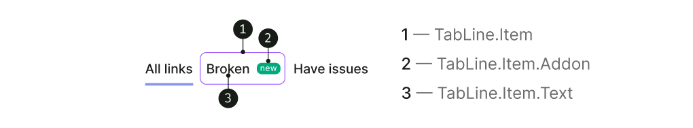

Component consists of the following:

- `TabLine.Item`
- `TabLine.Item.Addon`
- `TabLine.Item.Text`

## Appearance

### Sizes

TabLine has 2 sizes: M and L.

Table: TabLine sizes and margins

| Size (height in px) | Margins               |
| ------------------- | --------------------- |
| M (28px)            | 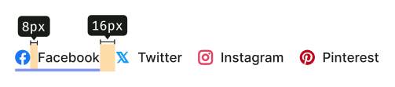 |
| L (40px)            | 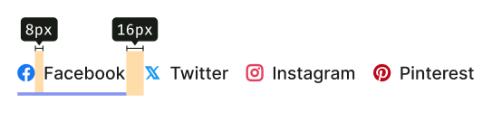 |

### Types

Depending on the context, you can use TabLine with or without `border-bottom`.

#### Tabs with border (underlined)

Use TabLine with `border-bottom` to visually separate navigation from the content. This is particularly helpful for secondary navigation on a page.

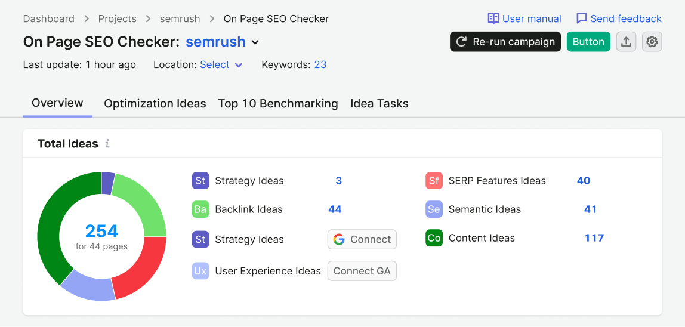

#### Tabs without border

Use TabLine without `border-bottom` for lower levels of navigation, such as switching data visualizations in widgets.

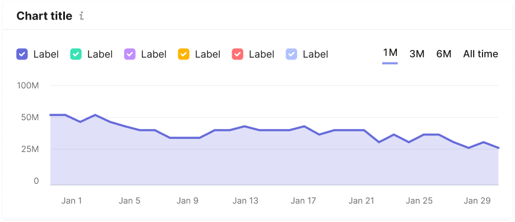

## Addons

Addons inside TabLine.Item have the same margins as addons inside the [Button](/components/button/button) component.

Table: Examples of addons for TabLine

| Addon   | Appearance example        |
| ------- | ------------------------- |
| Icon    | 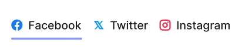      |
| Flag    | 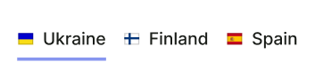      |
| Badge   | 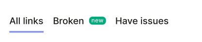     |
| Counter | 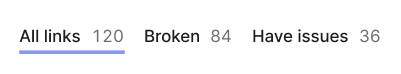   |

**Note the following:**

- Avoid placing a single icon without accompanying text inside `TabLine.Item` (tabs with `Ellipsis` icon is an exception, refer to [Usage in UX/UI section](/components/tab-line/tab-line#usage-in-ux-ui)).
- A flag and an icon can't be placed together in a tab.
- If both a [Badge](/components/badge/badge) and a [Counter](/components/counter/counter) are present inside the tab, the Badge should be placed after the Counter.

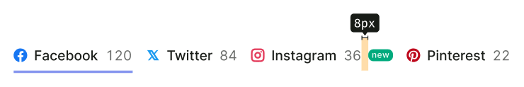

## Interaction

Table: TabLine states

| State                        | Appearance example                                                                                                                                                                                                        |
| ---------------------------- | ------------------------------------------------------------------------------------------------------------------------------------------------------------------------------------------------------------------------- |
| <nobr>Normal & Active</nobr> | 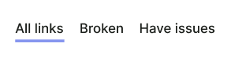                                                                                                                                                                                             |
| Hover                        | 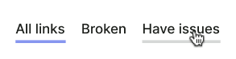                                                                                                                                                                                                     |
| Disabled                     | 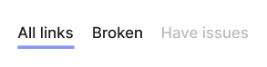                                                                                                                                                                                                  |
| <nobr>Initial loading</nobr> | When indicating that data is being loaded for the first time in the counter inside `TabLine.Item`, use Skeleton with the size of the text's line-height. 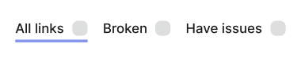                                  |
| Loading                      | When showing that data in the counter inside `TabLine.Item` is currently being loaded, use [Spin](/components/spin/spin) with the smallest size (same as in [Button](/components/button/button)). 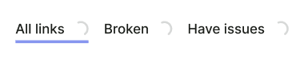 |

## Placement

TabLine is always placed under the [ProductHead](/components/product-head/product-head) of the report, following the title, additional controls, and filters that affect the entire report.

- The margin between ProductHead content and TabLine is always 24px.
<!-- vale DevDocs.Inclusive = NO -->
- The margin between TabLine and the title/widget below is always 16px.
<!-- vale DevDocs.Inclusive = YES -->

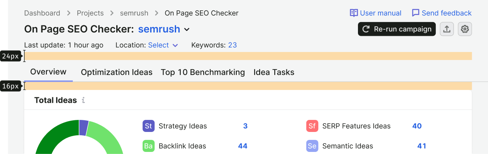

## Usage in UX/UI

When there's not enough space to show the full tab text, it's truncated with [ellipsis](../../utils/ellipsis/ellipsis), showing a [hint](../../utils/hint/hint) on hover.

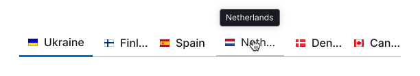

Additionally, you can collapse the last tabs into a tab with an `Ellipsis` icon. By clicking on the last tab with an `Ellipsis` icon, open dropdown with a list of items that didn't fit. The selected item from this list is then placed before the tab with the `Ellipsis` icon.

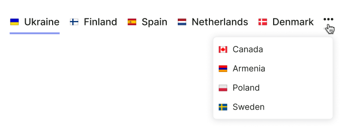

Use TabLine to group homogeneous content and navigate through the groups.

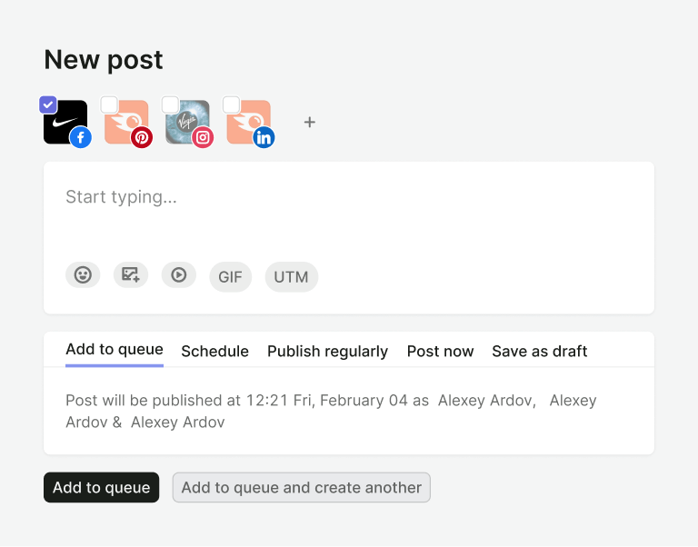

TabLine can also be used on settings pages and landings to separate information that differs in meaning.

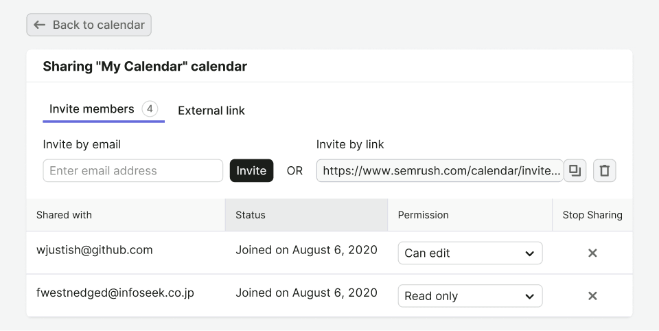

The rules for the naming and ordering of items are similar to the [Pills](/components/pills/pills) component, and the rules for the `disabled` state are also similar to the Pills.

