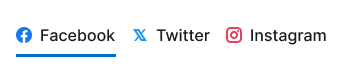
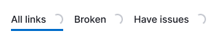

@import playground

@## Description

**TabLine** is a component for grouping homogeneous content on a page and secondary navigation.

> 💡 Do not use the TabLine for basic navigation. For this purpose use the main menu as it is more important in terms of visual hierarchy. Also, do not use this component for switching states. [Switch](/components/switch/) and [Radio](/components/radio/) can be used for it.

@## Appearance

Component composition:

- container;
- text;
- icon/flag in front of the text (optional);
- counter and/or badge after the text (optional).

### Sizes and paddings

In all TabLine sizes:

- the right padding is 16px (except for `last-child`);
- padding of addons before and after the text is 8px.

| Size      | Paddings                     | Styles                                                                 |
| --------- | ---------------------------- | ---------------------------------------------------------------------- |
| XL (42px) |  | `font-size: 16px; line-height: 1.37em; height: 42px; before-icon: m;`  |
| L (32px)  |    | `font-size: 14px; line-height: 1.29em; height: 32px; before-icon: s;`  |
| M (26px)  |    | `font-size: 12px; line-height: 1.33em; height: 26px; before-icon: xs;` |

### Addons (optional elements)

Addon indents in tabs correspond to addon indents in [Button](/components/button/) and other controls.

> 💡 Please note that **the icon CANNOT stand alone in the tab** without any text.

|                       | Appearance example               |
| --------------------- | -------------------------------- |
| icon before the text  |    |
| flag before the text  |    |
| badge with the status |  |
| counter               |    |

> 💡 **A flag and an icon cannot be placed in a tab at the same time**. If there is a badge inside the tab with a counter, it is always placed after the counter.

@## Types

In our interface, we can use alternative tabs with or without a border depending on the context. The border has `$mercury` color.

### Tabs with border

If such tabs need to be visually separated from the content they switch, use tabs with a border. Usually they are used for secondary navigation on the page.

### Tabs without border

If you do not need to separate tabs from the content they switch, use tabs without a border. Usually they are used to switch content inside a widget.

@## Interaction

| State    | Appearance                                     | Styles                                                                                                                                                                                                            |
| -------- | ---------------------------------------------- | ----------------------------------------------------------------------------------------------------------------------------------------------------------------------------------------------------------------- |
| normal   |       | `color: $gray20; icon-color: $gray60;`                                                                                                                                                                            |
| hover    |                | `border-bottom: 2px solid $stone;`                                                                                                                                                                                |
| active   |       | `border-bottom: 2px solid $light-blue;`                                                                                                                                                                           |
| disabled |          | `opacity: .3;`                                                                                                                                                                                                    |
|          |  | Either a separate item or all tabs can be in the `disabled` state.                                                                                                                                                |
| loading  |            | When it is necessary to show that the data in the counter inside the tab is being loaded, we use [Spin](/components/spin/) of the corresponding size (the sizes are the same as in [Button](/components/button)). |

### Animation

To switch active tabs, the lower blue border should move from ease transition в `.50s`.

@## Use in UX/UI

Use TabLine to group homogeneous content and navigate through these groups.

You can also use the TabLine on the settings pages and landings to separate information that is different in meaning.

The rules for the name and order of items are similar to the [Pills](/components/pills/) component. The rules for the `disabled` state are also similar to the [Pills](/components/pills/).

### Exceptions

The only case when TabLine is not used to navigate through content groups is when you switch the period in the widgets with charts.

### Placement in the interface

The TabLine is always on top of the switched content. The indents between them and other controls or content should be multiples of 4.

@page tab-line-a11y
@page tab-line-api
@page tab-line-code
@page tab-line-changelog
