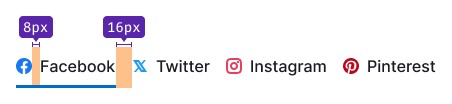
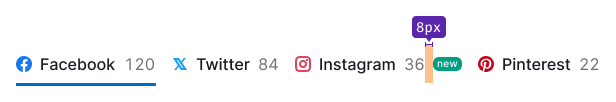
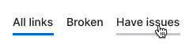
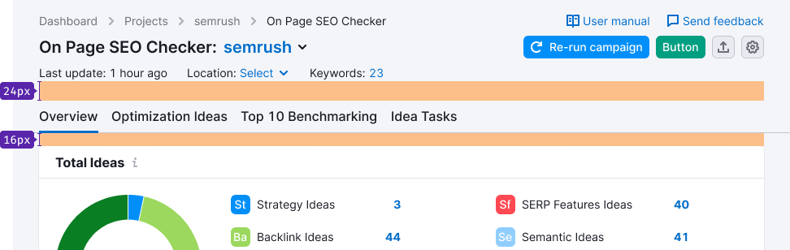

@import playground

@## Description

**TabLine** is a component for navigating inside a report and grouping homogeneous content in the interface.

> **Do not use this component:**
>
> - for basic navigation in your interface. For this purpose use the main menu instead as it is more apropriate in terms of visual hierarchy;
> - for switching states. For these cases use [Switch](/components/switch/) or [Radio](/components/radio/) instead.

@## Appearance

### Sizes and paddings

For TabLine of all sizes sizes:

- the right margin of TabLine.Item is 16px (except for `last-child`);
- margins of addons before and after the text is 8px.

| Size | Margins                    |
| ---- | -------------------------- |
| M    |  |
| L    |  |

### Addons

Addons inside TabLine.Item has the same margins addons inside the [Button](/components/button/) have.

> 💡 Please do not place icon without a text inside TabLine.Item.

| Addon   | Appearance example               |
| ------- | -------------------------------- |
| Icon    |    |
| Flag    |    |
| Badge   |  |
| Counter |    |

> 💡 **A flag and an icon can not be placed in a tab at the same time**. If there are badge and counter inside the tab, then place badge after the counter.

@## Types

Depending on the context you can use TabLine with or without border-bottom. The border has `--gray-200` color.

### Tabs with border

Use TabLine with border-bottom to visually separate navigation from the content it switchs. Usually it's helpful for secondary navigation on the page.

### Tabs without border

Use TabLine with border-bottom if you do not need to separate navigation from the content. Usually it's useful for switching content inside a widget.

@## Interaction

| State           | Appearance                                           | Styles                                                                                                                                                                                                               |
| --------------- | ---------------------------------------------------- | -------------------------------------------------------------------------------------------------------------------------------------------------------------------------------------------------------------------- |
| normal          |             | `color: var(--gray-800);`                                                                                                                                                                                            |
| hover           |                      | `border-bottom: 2px solid var(--gray-200);`                                                                                                                                                                          |
| active          |             | `border-bottom: 2px solid var(--blue-400);`                                                                                                                                                                          |
| disabled        |                | `opacity: .3;`                                                                                                                                                                                                       |
| initial loading |  | When it is necessary to show that the data in the counter inside the TabLine.Item is being loaded for the first time, use [Skeleton](/components/skeleton/) with the size of the text's line-height.                 |
| loading         |                  | When it is necessary to show that the data in the counter inside the TabLine.Item is being loaded, use [Spin](/components/spin/) with the smallest size (the sizes are the same as in [Button](/components/button)). |

### Animation

While switching active tabs, the border-bottom moves with `ease` transition and `500ms` duration.

@## Placement in the interface

TabLine is always placed under the [ProductHead](/components/product-head/) of the report, after the title, additional controls and filters that affect the entire report.

- **The margin between ProductHead and TabLine is always 16px.**
- The margin between TabLine and title/widget below is always 16px.

@## Long text

In cases when you have many tabs or there is not enough space for the tab text, collapse the text into the `ellipsis`.

> 💡 Be sure to add the full text tooltip to such tabs.

@## Use in UX/UI

Use TabLine to group homogeneous content and navigate through the groups.

You can also use the TabLine on the settings pages and landings to separate information that differs in meaning.

The rules for the name and order of items are similar to the [Pills](/components/pills/) component. The rules for the `disabled` state are also similar to the [Pills](/components/pills/).

@page tab-line-a11y
@page tab-line-api
@page tab-line-code
@page tab-line-changelog
