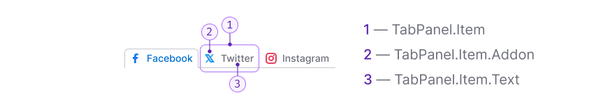
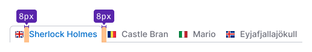
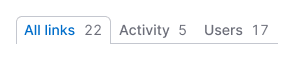
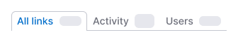
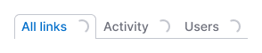
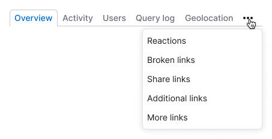

::: react-view

:::

## Description

**TabPanel** is a component designed for grouping heterogeneous content.

**Don't use this component in the following scenarios:**

- As the main navigation in your interface; instead, use the main menu, which offers better visual hierarchy.
- For switching between states; for this purpose, use either the [Switch](/components/switch/switch) or [Radio](/components/radio/radio) components.

## Component composition

Component consists of the following:

- `TabPanel.Item`
- `TabPanel.Item.Addon`
- `TabPanel.Item.Text`

## Appearance

### Sizes

The TabPanel.Item has a `margin-right: var(--spacing-4x)` (except for the `last-child`).
Addons before and after the text have a margin of 8px.

### Addons

Addons inside TabPanel.Item have the same margins as addons inside the [Button](/components/button/button) component.

Table: Examples of addons for TabPanel

| Addon   | Appearance example        |
| ------- | ------------------------- |
| Icon    |       |
| Flag    |       |
| Badge   |      |
| Counter |    |

**Note the following:**

- Avoid placing a single icon without accompanying text inside `TabPanel.Item` (tabs with `Ellipsis` icon is an exception, refer to [Usage in UX/UI section](/components/tab-line/tab-line#usage-in-ux-ui)).
- A flag and an icon cannot be placed together in a tab.
- If both a [Badge](/components/badge/badge) and a [Counter](/components/counter/counter) are present inside the tab, the Badge should be placed after the Counter.

## Interaction

::: tip
We recommend adding links to tabs so that users can open different tabs of the report in separate tabs using the right mouse button if necessary.
:::

Table: TabPanel states

| State           | Appearance     | Styles     |
| --------------- | -------------- | ---------- |
| Normal          |             | `color: var(--text-secondary)`    |
| Hover           |                      | `color: var(--text-primary)`    |
| Active          |             | `color: var(--text-link)`, `border-width: 1px 1px 0px 1px`, `border-style: solid`, `border-color: var(--border-primary)` `border-radius: 6px 6px 0px 0px`                                                        |
| Disabled        |                | Use the `--disabled-opacity` token.     |
| Initial loading |  | When indicating that data is being loaded for the first time in the counter inside `TabPanel.Item`, use [Skeleton](/components/skeleton/skeleton) with the size of the text's line-height.                 |
| Loading         |                  | When showing that data in the counter inside `TabPanel.Item` is currently being loaded, use [Spin](/components/spin/spin) with the smallest size (same as in [Button](/components/button/button)).|

## Usage in UX/UI

In cases where you have numerous tabs or there isn't enough space for the full tab text, truncate the text using an `ellipsis`.

::: tip
Make sure to add a tooltip with the full text message to such collapsed tabs.
:::

Additionally, you can collapse the last tabs into a tab with an `Ellipsis` icon.

::: tip
By clicking on the last tab with an `ellipsis` in the dropdown, it is possible to display a list of items that did not fit. The selected item from this list is then placed before the tab with the ellipsis.
:::

