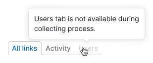

@import playground

@## Description

**TabPanel** is a component for navigating inside a report and grouping heterogeneous content. It is usually placed in the [ProductHead](/components/product-head) of the report.

> 💡 **Do not use TabPanel for basic navigation.** For this purpose, use the left menu as it is more important in terms of visual hierarchy of the page. Do not use TabPanel for switching states, use [Switch](/components/switch/) and [Radio](/components/radio/) for it.

@## Appearance

The TabPanel component has one size, which is L (`height: 32px`). Addon padding before and after text is 8px. Right and left margins of the component are always 30px.

| Margins and paddins                        | Styles                                 |
| ------------------------------------------ | -------------------------------------- |
|  | `font-size: 14px; line-height: 1.2em;` |

@## Addons

Addons in the TabPanel are optional. Their Paddings are the same as for addons in [Button](/components/button/) and other controls.

> 💡 Please note that **the icon cannot stand alone in the tab without any text**.

|                                 | Indents                          |
| ------------------------------- | -------------------------------- |
| Icon of S size in front of text |    |
| Flag before text                |    |
| Badge with status               |  |

> 💡 A flag and an icon cannot be placed in a tab at the same time.

@## Interaction

> 💡 It is recommended to make tabs with links, so that the user can open different tabs of the report in different tabs with the right mouse button if necessary.

| State    | Appearance                                | Styles                                                                                                            |
| -------- | ----------------------------------------- | ----------------------------------------------------------------------------------------------------------------- |
| normal   |  | `color: $gray40; icon-color: $gray40;`                                                                            |
| hover    |           | `color: $gray20;`                                                                                                 |
| active   |  | `color: $denim-blue; border: 1px solid $gray80; border-bottom: 1px solid #fff;`                                   |
| disabled |     | `opacity: .3;` If the tab is in the disabled state, it is necessary to put a tooltip explaining the reason on it. |

@## Placement in the interface

TabPanel is always placed under the [ProductHead](/components/product-head/) of the report, after the title, additional controls and filters that affect the entire report.

- **The margin between ProductHead and TabPanel is always 16px.**
- The margin between TabPanel and title/widget below is always 24px.

@## Text shortening in the tab

In cases when we have many tabs or there is not enough space for the tab text, we shorten the text into the `ellipsis`.

> 💡 Be sure to put the full text tooltip on the tabs with the text shortened into the `ellipsis`.

@page tab-panel-api
@page tab-panel-code
@page tab-panel-changelog
