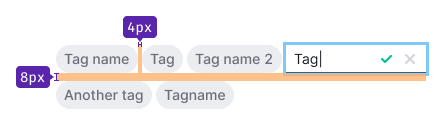
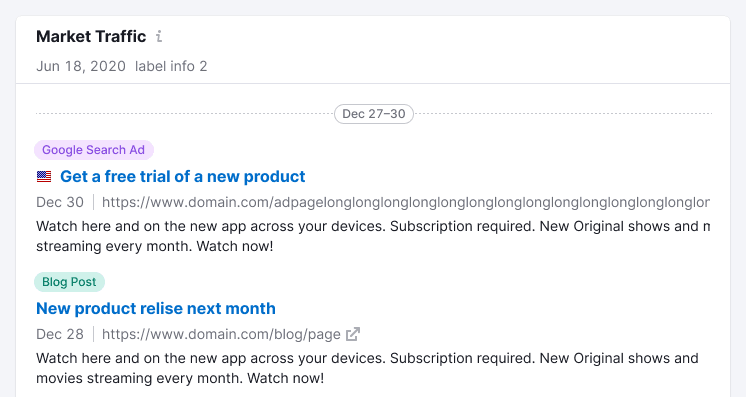

@import playground

@## Description

**Tag** is a component for thematic grouping of information in the interface (in tables, filters, cards, etc.).

Tag is usually set by the system or by the user.

@## Component composition

Component consists of:

- text;
- icon or any other addon before the text (optional);
- Close icon (optional).

@## Sizes and paddings

|     | Paddings                                                     |
| --- | ------------------------------------------------------------ |
| XL  |   |
| L   |       |
| M   |       |

@## Types

There are several types of tags.

| Tag type         | Appearance example                     | Description                                                                                                                                                                                                                           |
| ---------------- | -------------------------------------- | ------------------------------------------------------------------------------------------------------------------------------------------------------------------------------------------------------------------------------------- |
| Primary          |          | The main type of tag for using on a light background. 💡 Any color from our [color palette](/style/palette/) can be set as a tag color, the default color is `--gray-500` (background gets color with 100 shade — e.g. `--gray-100`). |
| Secondary        |      | The secondary tag type for using on a light background when it is necessary to make the contrast between the promary and secondary tags.                                                                                              |
| Primary Invert   |    | It is an inversion of the primary tag for using on dark or colored background.                                                                                                                                                        |
| Secondary Invert |  | It is an inversion of the secondary tag for using on dark or colored background.                                                                                                                                                      |

@## Interaction

| Tag type         | States                                             |
| ---------------- | -------------------------------------------------- |
| Primary          |    |
| Primary invert   |            |
| Secondary        |         |
| Secondary invert |  |

@## Tag creation

User can create a tag using a tag with the additional theme.

| State  | Appearance                          | Styles                                                                                       |
| ------ | ----------------------------------- | -------------------------------------------------------------------------------------------- |
| normal |  | `color: var(--gray-500); background-color: var(--white); border: 1px dotted var(--gray200);` |
| hover  |   | `background-color: var(--gray-50);`                                                          |
| active |  | `background-color: var(--gray-50);`                                                          |

This tag opens [InlineInput](/components/inline-input/). You can add a [mask label](/components/input-mask/) to keep the user in the context of what he needs to type into the input.

By clicking on the Check icon or `Enter`, the value in the input is saved and wraps into a tag.

If the space for tag placement is limited, then reduce the text into the `ellipsis`. When hovering over a tag with the `ellipsis`, show the tooltip with the full tag label.

@## Tag editing

If the user has the ability to edit tags. If tag is clickable it opens [InlineInput](/components/inline-input/). The logic is the same as tag creation has.

@## Long text

You can set the maximum width of the tag.

If the text of a tag exceeds the maximum width, collapse it into `ellipsis` and show a tooltip with a full tag label while hovering over such tag.

<!-- @## Minimizing number of tags

In case you have a huge number of tags and do not need to show them all at once, minimize them to a tag with three dots. When you click on it, all hidden tags will be opened.

> 💡 Unfortunately, this solution can be found in several places so far.

 -->

@## Margins between tags

|     | Margins                               |
| --- | ------------------------------------- |
| XL  |  |
| L   |    |
| M   |    |

<!-- @## Tag and other components

Recommendations on positioning of tags in relation to other components:

- In most cases, place tag to the right of the component.
- In the card, place tag at the bottom. -->

@## Use in UX/UI

Use tags for visual marking of objects, fast recognition and navigation.

### Example of use in a card

### Example of use in the table

@page tag-a11y
@page tag-api
@page tag-code
@page tag-changelog
