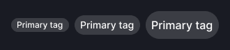
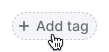

@import playground

@## Description

**Tag** is a component for thematic grouping of information in the interface (in tables, filters, cards, etc.).

Tag is usually set by the system or by the user.

@## Component composition

Component consists of:

- text;
- icon or any other addon before the text (optional);
- `Close` icon (optional).

@## Sizes and paddings

Size (height in px) | Paddings                                                     |
| --------- | ------------------------------------------------------------ |
| M (20px)  |       |
| L (28px)  |       |
| XL (40px) |   |

@## Themes

There are several themes of tags.

| Tag theme                         | Appearance example                                           | Description                                                                                                                                                                                                                        |
| --------------------------------- | ------------------------------------------------------------ | ---------------------------------------------------------------------------------------------------------------------------------------------------------------------------------------------------------------------------------- |
| `primary`                         |                    | The main type of tag for using on a light background. Any color from our [color palette](/style/design-tokens/) can be set as a tag color, the default color is `--gray-500` (background gets color with 100 shade — e.g. `--gray-100`). |
| `secondary`                       |                | The secondary tag type for using on a light background when it is necessary to make the contrast between the primary and secondary tags.                                                                                           |
| `primary` with `color:"white"`    |      | It is an inversion of the primary tag for using on dark or colored background.                                                                                                                                                     |
| `secondary` with `color:"white"`  |  | It is an inversion of the secondary tag for using on dark or colored background.                                                                                                                                                   |
| `additional`                      |              | The additional type for special tag that adds other tag.                                                                                                                                                                           |
| `additional` with `color:"white"` |       | It is an inversion of the additional type for special tag that adds other tag.                                                                                                                                                     |

@## Interaction

| Tag theme                        | States                                                                |
| -------------------------------- | --------------------------------------------------------------------- |
| `primary`                        |             |
| `primary` with `color:"white"`   |              |
| `secondary`                      |                |
| `secondary` with `color:"white"` |  |

@## Adding tag

User can create a tag using a tag with the `additional` theme.

| State  | Appearance                          | Styles                                                                                                                         |
| ------ | ----------------------------------- | ------------------------------------------------------------------------------------------------------------------------------ |
| Normal |  | `color: var(--text-secondary)`, `background-color: var(--tag-secondary-normal)`, `border: 1px dotted var(--border-primary)` |
| Hover  |   | `background-color: var(--tag-secondary-hover-active)`                                                                         |
| Active |  | `background-color: var(--tag-secondary-hover-active)`                                                                         |

This tag opens [InlineInput](/components/inline-input/). You can add a [mask label](/components/input-mask/) to keep the user in the context of what he needs to type into the input.

By clicking on the Check icon or `Enter`, the value in the input is saved and wraps into a tag.

If the space for tag placement is limited, then reduce the text into the `ellipsis`. When hovering over a tag with the `ellipsis`, show the tooltip with the full tag label.

@## Editing tag

For editable tags use [InlineInput](/components/inline-input/) component as for the adding tag case. [See live example](/components/tag/tag-code/#editing_tag).

@## Long text

You can set the maximum width for the tag.

If the text of a tag exceeds the maximum width, collapse it into `ellipsis` and show a tooltip with a full tag label while hovering over such a tag.

<!-- @## Minimizing number of tags

In case you have a huge number of tags and do not need to show them all at once, minimize them to a tag with three dots. When you click on it, all hidden tags will be opened.

> Unfortunately, this solution can be found in several places so far.

 -->

@## Margins between tags

Size (height in px) | Margins                               |
| --------- | ------------------------------------- |
| M (20px)  |    |
| L (28px)  |    |
| XL (40px) |  |

<!-- @## Tag and other components

Recommendations on positioning of tags in relation to other components:

- In most cases, place tag to the right of the component.
- In the card, place tag at the bottom. -->

@## Usage in UX/UI

Use tags for visual marking of objects, fast recognition and navigation.

### Example of use in a card

### Example of use in the table

@page tag-a11y
@page tag-api
@page tag-code
@page tag-changelog
