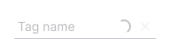
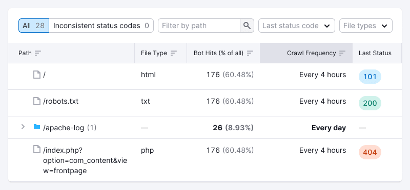

::: react-view

:::

## Description

**Tag** is a component used to thematically group information in the interface, commonly found in tables, filters, cards, and other components.

Tags are typically set either by the system or by the user.

## Component composition

Component consists of the following:

- `Tag.Text`
- `Tag.Addon` — an icon or some other small element before the text
- `Tag.Close` — a button that removes the tag
- `Tag.Circle` — a round addon, usually an image.

## Appearance

### Sizes

Table: Tag sizes

| Size (height in px) | Appearance example                             |
| ------------------- | ---------------------------------------------- |
| M (20px)            |     |
| L (28px)            |     |
| XL (40px)           |   |

### Themes

The component offers several themes for tags.

Table: Tag themes

| Tag theme                         | Appearance example                | Description                                                                                                               |
| --------------------------------- | --------------------------------- | ------------------------------------------------------------------------------------------------------------------------- |
| `primary`                         |            | The `primary` theme of tag suitable for use on a light background. The default color is `--gray-500`.                     |
| `primary` with `color:"white"`    |     | An inversion of the `primary` tag is used on the dark or colored backgrounds.                                             |
| `secondary`                       |          | The `secondary` tag theme, useful on a light background when contrast between the primary and secondary tags is required. |
| `secondary` with `color:"white"`  |   | An inversion of the `secondary` tag suitable for dark or colored backgrounds.                                             |
| `additional`                      |         | Ideal for special tags that are added to other tags.                                                                      |
| `additional` with `color:"white"` |  | An inversion of the `additional` theme used for special tags that are added to other tags.                                |

#### Tag colors

To change tag color, use colors with 500 tone from [our palette tokens](/style/design-tokens/design-tokens#base-tokens-palette), since they are selected with the 60Lc contrast (according to APCA) between the text and background. Refer to [Custom color example](/components/tag/tag-code#custom-color).

In the case where you use other colors to color the tag, make sure to [check the contrast of the tag text against the background](/core-principles/a11y/a11y-design#color-and-contrast).

## Additional theme

Use Tag with `additional` theme and `interactive` property, to create such an element.

| State  | Appearance example     | Styles                                                                                                                      |
| ------ | ---------------------- | --------------------------------------------------------------------------------------------------------------------------- |
| Normal |  | `color: var(--text-secondary)`, `background-color: var(--tag-secondary-normal)`, `border: 1px dotted var(--border-primary)` |
| Hover  |   | `background-color: var(--tag-secondary-hover-active)`                                                                       |
| Active |  | `background-color: var(--tag-secondary-hover-active)`                                                                       |

This tag opens [InlineInput](/components/inline-input/inline-input).

Upon clicking the `Check` icon or pressing `Enter`, the input value is saved and transformed into a tag.

If space for tag placement is limited, the text should be truncated with an `ellipsis`. Hovering over a tag with an `ellipsis` should display a tooltip with the full tag label.

## Grouped tags

Table: Grouped tags

| Size (height in px) | Margins                        |
| ------------------- | ------------------------------ |
| M (20px)            |   |
| L (28px)            |   |
| XL (40px)           |  |

## Editing tag

For editable tags, use the [InlineInput](/components/inline-input/inline-input) component. Refer to the [live example](/components/tag/tag-code#editing-tag).

## Long text

You can set a maximum width for the tag. If the text of a tag exceeds this limit, it will be collapsed with an `ellipsis`, and hovering over the tag will show a tooltip with the full tag label.

<!-- @## Minimizing number of tags

In case you have a huge number of tags and don’t need to show them all at once, minimize them to a tag with three dots. When you click on it, all hidden tags will be opened.

::: tip
Unfortunately, this solution can be found in several places so far.
:::

 -->

## Usage in UX/UI

Use tags for visual marking and grouping of information and objects.

### Usage in card example

### Usage in table example

