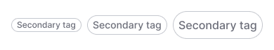
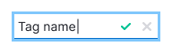

@import playground

@## Description

**Tag** is a word or phrase for thematic grouping of information in the interface (in tables, filters, cards, etc.).

It is usually set by the system or by the user himself.

@## Appearance

### Component composition

- container;
- text;
- icon or any other element in front of the text (optional);
- Close icon (optional);
- label mask (optional).

> 💡 Do not misuse the optional element before the tag text. Do not complicate it.

@## Sizes and indents

|     | Appearance and indents                                             |
| --- | ------------------------------------------------------------------ |
| XL  |   |
| L   |          |
| M   |          |
| S   |          |

@## Types

Several types of tags can be used in our tools depending on the context.

### Primary

This is the main type of tag for use on a light background.

> 💡 Any color of our [color palette](/style/color/) can be set as a tag color, the default color is `$asphalt`.

### Secondary

A secondary tag type for use on a light background is needed for cases when you need the contrast between the main tag and additional tags.

### Primary Invert

This tag type is an inversion of the main view for use on dark or colored background.

### Secondary Invert

This tag type is an inversion of a secondary view for use on a dark or colored background.

@## Interaction

The main tag type has the same `hover` and `active` styles.

| Tag type         | States                                                |
| ---------------- | ----------------------------------------------------- |
| Primary          |    |
| Primary invert   |            |
| Secondary        |         |
| Secondary invert |  |

### Tag put by the system

If the tag is put by the system:

- the color is determined and chosen by the system from [basic color palette](/style/color/) or from the additional palette if necessary.
- The tag can be clickable. In this case, only filtering takes place.
- Tag cannot be edited.

> 💡 **You should mainly use the same color for the tags of the same meaning.** For example, we made green `New` tags, and `You` tags are blue.

@## Tag creation

The user can create a tag using a special tag with the following styles.

| State  | Appearance                          | Styles                                                                 |
| ------ | ----------------------------------- | ---------------------------------------------------------------------- |
| normal |  | `color: $gray40; background-color: $white; border: 1px dotted $stone;` |
| hover  |   | `color: $gray20; background-color: $white;`                            |
| active |  | `color: $gray40; background-color: $gray94;`                           |

Clicking such a tag opens the input. You can prescribe a mask label in the input to keep the user in the context of what he needs to type into the new input.

Input with a long tag text inside does not increase its width, but behaves the same way as input with a large amount of text, so the text goes to the left inside the input.

By clicking on the icon or `Enter`, the value in the input is saved and turns into a tag.

If the space for tag placement is limited, then we reduce the text into the `ellipsis` after a certain width of the tag is reached when wrapping the text into it.

The component has an option to set the maximum width of the tag for such cases. When hovering over a tag with the `ellipsis`, it is necessary to show the tooltip with the full tag label.

@## Tag editing

If the user has the ability to add tags to the data in the interface, it should always be possible to edit them. Clicking such a tag opens the input. The logic is the same as when adding a tag.

@## Long text in tag

You can set the maximum width of the tag. This is an optional feature as it is not always necessary when using a component.

If the text of a tag exceeds the specified width, it will hide in the `ellipsis`. A tooltip with a full tag label must appear when hovering over such tag.

@## How to minimize tags if there are too many of them

In case you have a huge number of tags and do not need to show them all at once to the user, minimize them to a tag with three dots. When you click on it, all hidden tags will be opened.

> 💡 Unfortunately, this solution can be found in several places so far.

@## Location

The tags always have margins multiple of 4 towards each other.

|     | Margins                                  |
| --- | ---------------------------------------- |
| XL  |  |
| L   |    |
| M   |    |
| S   |    |

Recommendations on positioning of tags in relation to other components:

- In most cases, the tag is located to the right of the element.
- In the card, it is typically placed at the bottom.

@## Use in UX/UI

Use tags for visual marking of objects, fast recognition and navigation.

### Example of use in a card (any essence within a frame of content)

### Example of use in the table

@page tag-a11y
@page tag-api
@page tag-code
@page tag-changelog
