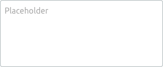
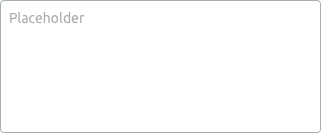
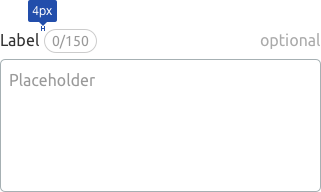
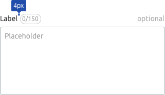
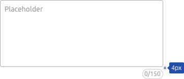
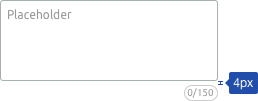
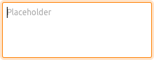
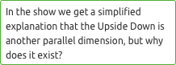
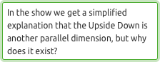
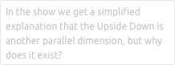

@import playground

@## Description

**Textarea** is an input for entering multiline text: comment, description, link list, document text, etc.

@## Appearance

### Sizes

|     | Appearance                               |
| --- | ---------------------------------------- |
| XL  |  |
| L   |  |
| M   |  |

### Size change

You can enable the text area to change the size of the component so that it is stretched only horizontally, only vertically, or vertically and horizontally simultaneously.

For those cases when it is not necessary to stretch the text area, a scroll may appear in it after a certain number of lines. **The minimum number of lines after which it is recommended to use scroll is 4-5.**

> 💡 **Do not make the text area smaller than 160-200px in width and 3-4 lines in height**. It is very difficult to work with large amounts of data in sizes smaller than these are. This is especially important when such an input is basic in form.

### Counter

Text area may contain a counter showing the number of available characters, limits and so on.

The counter can be placed either next to the area label or near the area itself (for example, under it or on its right).

|     | Input with label                         | Input without label                            |
| --- | ---------------------------------------- | ---------------------------------------------- |
| XL  |  |  |
| L   |    |    |
| M   |    |    |

@## Interaction

Styles of the text area in different states correspond to the styles of the input for such states.

### Focus

### Invalid

### Valid

### Disabled

### Read-only

@## Use in UX/UI

- Use the text area as intended. It is suitable when the user needs to enter a large amount of data into a single area. If the user needs to enter 1-3 words, use [Input](/components/input/).
- Name the area in such a way that the user understands what data should be entered at first glance.

@page textarea-api
@page textarea-code
@page textarea-changelog
