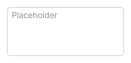
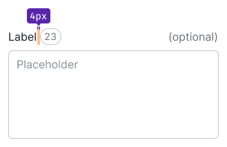
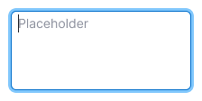
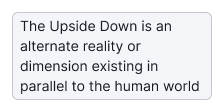
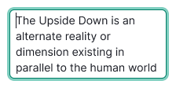
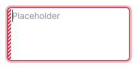

@import playground

@## Description

**Textarea** is an input for entering multiline text: comment, description, link list, etc.

@## Sizes

| Input size | Appearance example                 |
| ---------- | ---------------------------------- |
| M          |  |
| L          |  |

### Resize control

You can enable the resize control for the textarea to change its size. So user can stretch only horizontally, only vertically, or both vertically and horizontally.

When textarea cannot be stretched, show scrollbar after a certain number of lines. **The minimum number of lines after which we recommended to use scroll is 4-5.**

> 💡 **Do not make the textarea smaller than 160-200px in width and 3-4 lines in height**. It is very difficult to work with large amounts of data in sizes smaller than these are. This is especially important when such an input is basic input in a form.

@## Counter

Textarea may contain a counter showing the number of entered and/or available characters, limits, etc.

The counter can be placed either next to the text label or near the textarea itself.

| Input size | Input with label                                       | Input without label                                          |
| ---------- | ------------------------------------------------------ | ------------------------------------------------------------ |
| M          |  |  |
| L          |  |  |

@## Interaction

Styles of the textarea in different states correspond to the styles of the [Input](/components/input/) for such states.

| State   | normal                                 | focus                                                     | disabled                                 | read-only                                |
| ------- | -------------------------------------- | --------------------------------------------------------- | ---------------------------------------- | ---------------------------------------- |
| normal  |          |                       |  |  |
| valid   |      |        |                                          |                                          |
| invalid |  |  |                                          |                                          |

@## Use in UX/UI

- Textarea is suitable when user needs to enter a large amount of data into a single area. If user needs to enter 1-3 words, use [Input](/components/input/).
- Name the textarea in such a way that user understands what data should be entered at a first glance.

@page textarea-a11y
@page textarea-api
@page textarea-code
@page textarea-changelog
