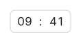
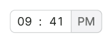
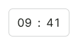
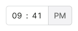
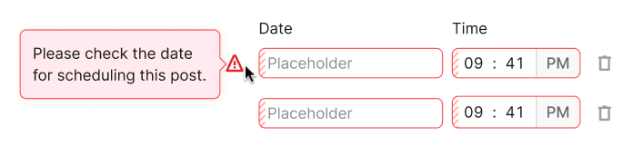

<Playground for="TimePicker" />

## Description

**Time picker** is a component that consists of comboboxes designed for entering or selecting a time value.

## Component composition

Component consists of the following:

- `TimePicker.Hours`
- `TimePicker.Minutes`
- `TimePicker.Format`
- `TimePicker.Separator`

## Appearance

### Sizes

Table: TimePicker sizes

| Input size (height in px) | Appearance example                                      |
|---------------------------|---------------------------------------------------------|
| M (28px)                  |   |
| L (40px)                  |   |

## Comboboxes

The content of the comboboxes can be exact, up to a minute, or with preset steps.

- In the first case, the combobox step equals one minute, allowing the user to set precise times, such as 13:13.
- In the second case, the combobox step can be adjusted depending on the required time pre-settings. For example, popular steps may include 00, 15, 30, 45, etc., for minutes.

::: tip
Comboboxes content may be both exact, up to a minute, and with the preset step.
:::

## Validation

### When TimePicker needs validation

Validation in this component is required in several cases:

- When there is a selection of multiple time slots, and they can't be set to equal values.
- When users can't select times in the past or future. In this case, the time selection also depends on the date selection, and the validation applies to the entire group of controls.

### How validation is performed

- All the fields related to the selection of the date and time receive the status `invalid`.
- A tooltip with the description of the error is shown in the first field without placing the focus on the field.
- Validation occurs upon submitting the entire form.

