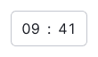
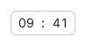
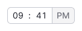
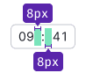
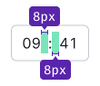

@import playground

@## Description

**Time picker** is a component with comboboxes for entering/selecting time.

@## Appearance

- The component includes two [comboboxes](/components/auto-tips/#a70085) inside the input.
- If user needs to choose the time in 12-hour format, then add button for switching AM/PM. It saves an extra click on the seelct opening.

### 24-hour format

### 12-hour format

@## Sizes and paddings

| Input size | Appearance                                                                          | Paddings                           |
| ---------- | ----------------------------------------------------------------------------------- | ---------------------------------- |
| M          |   |  |
| L          |   |  |

@## Interaction

The first combobox is hours selection, the second one is minutes selection.

Upon focus on the combobox, the list with all the possible variants is opened. Upon focus on this group of controls, at first the input is highlighted.

> The dropdown with the list is shifted to the left by 9px in order to put the list items accurately under the combobox figures.

The button switches the `am/pm value` by click.

Upon moving to the button using Tab, the button is highlighted with `focus`.

- Using the comboboxes inside the Time picker, the user may both select the time using the mouse and enter it manually.
- After the first field is completed, the cursor should move to the second field.
- The inputs should accept only figures with limitation of two symbols in each combobox.

### Comboboxes content

> Comboboxes content may be both exact, up to a minute, and with the preset step.

- In the first case the combobox step is equal to a minute. The user can set, for example, 13:13
- In the second case the combobox step can range depending on the required time pre-settings. For example, 00, 15, 30, 45 etc. are rather popular for minutes.

@## Validation

### Validation in this component is required in several cases

- when there is the selection of several time slots and they cannot be set equal;
- when you cannot select time in the past or the future (in this case the time selection also depends on the date selection and validation is common for the whole controls group).

### How the validation is performed

- All the fields related to selection of the date and time obtain the status `invalid`: Date picker, comboboxes inside Time picker, `am/pm` switch;
- The tooltip with the description of the error is shown in the first field, upon that the focus is not placed on the field (otherwise something would drop down from the field and prevent from understanding).
- Validation occurs by `Submit` of the whole form.

@## Use in UX/UI

The inputs width should be such as the scroll could be put into the dropdown list of the combobox, and it would be comfortable for the user to click the list items.

@page time-picker-a11y
@page time-picker-api
@page time-picker-code
@page time-picker-changelog
