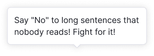
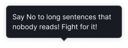
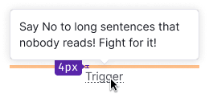

@import playground

@## Description

**Tooltip** is a popover to display all sorts of tips.

Differences from [Dropdown](/components/dropdown/):

- It appears only at hovering over the trigger.
- It has an arrow that points to the trigger.
- It contains only hints and additional information.

@## Types

There are two types of tooltips:

- default;
- advanced.

### Default tooltip

Default tooltip contains only unformatted text.

### Advanced tooltip

The advanced tooltip may contain:

- formatted text;
- simple like ([Button](/components/button/), [Link](/components/link/), etc.);
- image;
- different background color.

@## Themes

The tooltip has themes to use on a dark background and for error messages. In both cases, the text color changes to `--white` and the background color changes to the corresponding one.

| Theme   | Appearance                                 | Styles                                                                                                                 |
| ------- | ------------------------------------------ | ---------------------------------------------------------------------------------------------------------------------- |
| Default |  | `background-color: --var(white); border: 1px solid var(--gray-100); box-shadow: 0px 1px 12px 0px rgba(gray-800, .15);` |
| Invert  |    | `background-color: --var(gray-800); border: 1px solid var(--gray-500); box-shadow: 0px 1px 12px 0px #191B2326;`        |
| Warning |      | `background-color: --var(red-100); border: 1px solid var(--red-400; box-shadow: 0px 2px 5px 0px rgba(black, .25);`     |

> 💡 In [3.1.0 version](/components/tooltip/tooltip-changelog/), you can set your own theme and change background color to custom.

@## Maximum width and offset

The basic tooltip has a maximum width — `max-width: 280px`. In the advanced version of the tooltip, you can set a different width if necessary.

### Offset

The offset from the trigger to the tooltip is 4px.

@## Paddings and margins

The content area has defaul padding — 12px.

### Content margins and paddings

> 💡 Please note that it is better to use 14px for the title in the default non-advertising tooltip.

Image has size 130px \* 130px.

Arrow can be placed either in the middle of the component or next to any side. See live examples in the [Placement section](/components/tooltip/#aae13e).

### Margins inside the data

To make tooltip data more readable we have recommendation for margins between the labels and values.

See detailed examples for tooltip margins in [Data visualization](/data-display/chart/#ac9830) and [Summary](/patterns/summary/#a16f52).

@## Placement

- Tooltip is built with the [Popper.js](https://popper.js.org/) library. So you can change the placement of the component according to [Popper API](/utils/popper/popper-api/).

- Tooltip shouldn't change its position while scrolling a page (for example, if it appeared upwards, when scrolling it shouldn't appear at the edge of the browser and moved down). The default tooltip placement — top.

Placement properties:

@example placement

@## Interaction

The tooltip trigger can be a formatted text, table header, or other controls such as [Icon](/style/icon/), [Link](/components/link/), [Button](/components/button/), etc.

### Appearance and hiding

| Hidden                                                                            |                                |
| --------------------------------------------------------------------------------- | ------------------------------ |
| Cursor left the trigger (for basic tooltip)                                       |  |
| Cursor left the trigger or the tooltip itself (for advanced tooltip with control) |  |

### Delay of appearance and hiding

Default values for tooltip appearance and hiding:

- appearance: `100ms`;
- hiding: `50ms`.

If tooltip has controls inside, the time for hiding should be increased to `100ms`.

@## Use in UX/UI

Main recommendations:

- Use the tooltip to show hints and additional information. This can be text, formatted text with lists, links, buttons and small images.
- Make sure that the tooltip does not overlap the information important for the user.

> 💡 For complex content and forms, use [Dropdown-menu](/components/dropdown-menu/).

**If the tooltip trigger tells about the new feature, the tooltip title should not duplicate the trigger text.** The title may not be used if the trigger text already explains the tooltip content.

**When the trigger is not obvious enough, add a title to the tooltip.** It is also necessary to add a title when the trigger does not sufficiently explain the topic of the tooltip. For example, you can describe additional conditions in the header, or expand the idea behind the trigger.

**Divide long text into paragraphs.**

**Do not overload the tooltip with information.** The large amount of content is inconvenient to view in the tooltip. If there is too much content and you cannot remove anything, think about whether you need a separate paragraph on the page or widget instead of a tooltip.

**A tooltip should not prevent you from pointing the cursor at a nearby trigger.**

@page tooltip-a11y
@page tooltip-api
@page tooltip-code
@page tooltip-changelog
