::: tip New component 🎉
**Hint** is now separate from **Tooltip**. You can find its documentation in [Utils/Hint](../../utils/hint/hint).
:::

<Playground for="Tooltip" />

## Description

**Tooltip** is a component used to display additional information about features and data.

Differences between Tooltip, [Hint](../../utils/hint/hint), DescriptionTooltip ([Informer pattern](../../patterns/informer/informer)), and [Dropdown](/components/dropdown/dropdown):

|                                                   | Tooltip                                                          | Hint                                                        | DescriptionTooltip                                                             | Dropdown                                   |
| ------------------------------------------------- | ---------------------------------------------------------------- | ----------------------------------------------------------- | ------------------------------------------------------------------------------ | ------------------------------------------ |
| Contains                                          | Element's additional description 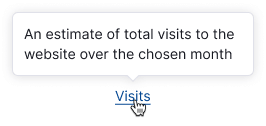 | Element's name, if hidden or cropped 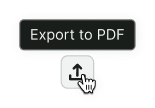 | Extra information about features or data 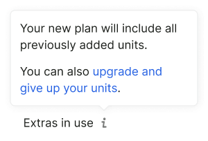 | Forms, settings 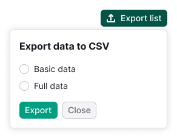 |
| Can contain interactive elements                  | ❌ No                                                            | ❌ No                                                       | ✅ Yes                                                                         | ✅ Yes                                     |
| Trigger is the same element the tooltip describes | ✅ Yes                                                           | ✅ Yes                                                      | ❌ No                                                                          | —                                          |
| Appears on                                        | Hover/focus                                                      | Hover/focus                                                 | Click/Enter                                                                    | Click/Enter                                |
| Has an arrow                                      | ✅ Yes                                                           | ❌ No                                                       | ✅ Yes                                                                         | ❌ No                                      |

Read more about the differences between **Tooltip** and **DescriptionTooltip** in [Interaction](#interaction) and [Content](#content).

## Component composition

It's useful to keep in mind that in code tooltips consist of two main parts:
- Trigger — the element that should be hovered, clicked on, etc, to show the tooltip,
- Popper — the tooltip itself, that is, the container for tooltip content.

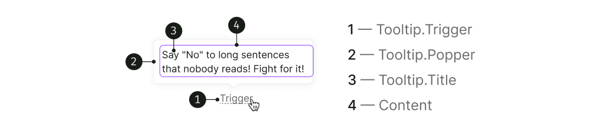

## Themes

Tooltip has three themes: `default`, `invert` for use on a dark background, and `warning` for validation messages. In all cases, the text color changes to `--text-primary-invert`, and the background color changes accordingly.

Table: Tooltip themes

| Theme   | Appearance example              | Styles      |
| ------- | ------------------------------- | ----------- |
| `default` | 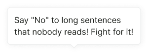 | `background-color: var(--tooltip-default)`, `border: 1px solid var(--border-secondary)`, `box-shadow: var(--box-shadow-popper)` |
| `invert` | 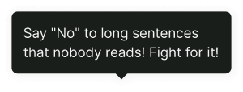   | `background-color: var(--tooltip-invert)`, `border: 1px solid var(--border-tooltip-invert)`, `box-shadow: var(--box-shadow-popper)` |
| `warning` | 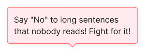     | `background-color: var(--tooltip-warning)`, `border: 1px solid var(--border-danger-active)`, `box-shadow: var(--box-shadow-popper)` |

## Appearance

### Maximum width and offset

By default, the Tooltip has a maximum width of 228px, but you can set a different width if needed.

#### Offset and arrow placement

The distance between the trigger and the tooltip is 4px.

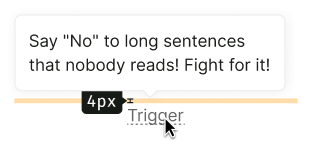

The placement of the arrow depends on the `placement` property, refer to the live examples in the [Placement](/components/tooltip/tooltip#placement) section.

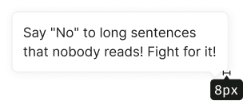

### Paddings and margins

The content area of the tooltip has a default padding of 12px.

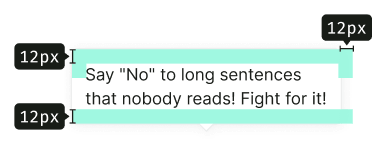

#### Content margins and paddings

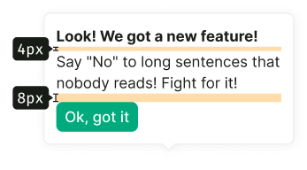

::: tip
It's recommended to use a font size of 14px (`--fs-200`, `--lh-200` tokens) for the title in non-advertising messages.
:::

The image inside the tooltip has a size of 130px * 130px.

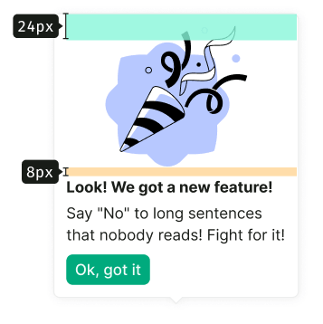

#### Data margins

To improve readability, it's recommended to use specific margins between labels and values inside the tooltip. Detailed recommendations for tooltip margins can be found in [Data visualization](/data-display/d3-chart/d3-chart#tooltip) and [Summary](/patterns/summary/summary#difference-value).

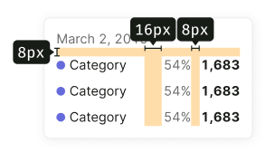

## Placement

The tooltip is built using the [Popper.js](https://popper.js.org/) library, allowing you to change its placement according to the [Popper API](/utils/popper/popper-api).

The default tooltip placement is `top`.

::: sandbox

:::

## Interaction

**Tooltip** is usually triggered by an interactive element, such as a [table header](../../table-group/data-table/data-table#tooltip), a [Button](../button/button), or a [Link](../link/link). Avoid using tooltips with non-interactive triggers like plain text and disabled controls: this makes tooltips inaccessible for keyboard and screen reader users.

**DescriptionTooltip** should have a separate trigger, such as a [ButtonLink with an Info icon](../../patterns/informer/informer) or a [ButtonLink](../button/button#button-with-link-styles) with "Learn more" text.

### Appearance and hiding

**Tooltip** appears on hover and hides when cursor leaves both the trigger and the popper. If the trigger is focusable, it also appear on focus and hide on unfocus or `Esc`.
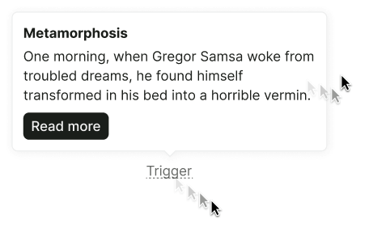

**DescriptionTooltip** appears on click or Space/Enter, and hides when user clicks or moves focus outside of both trigger and popper, or presses `Esc`.

### Delay of appearance and hiding

Default values for tooltip appearance and hiding:

- Appearance: `100ms`
- Hiding: `50ms`

If the tooltip has interactive elements inside, the hiding time should be increased to `100ms`.

## Content

Tooltip content is closely related to its behavior, so you should choose the appropriate component depending on what you intend to show inside the tooltip.

Table: Tooltip content

| Component            | Function                                                                                                                                                           | Content                                                                                                                                |
| -------------------- | ------------------------------------------------------------------------------------------------------------------------------------------------------------------ | -------------------------------------------------------------------------------------------------------------------------------------- |
| `Tooltip`            | Show additional information about an element with a visible label                                                                                                  | Short unformatted text, preferably no more than one sentence.                                             |
| `DescriptionTooltip` | Show information that's related not to the trigger itself, but to another element or the feature in general ([Informer pattern](../../patterns/informer/informer)) | Any amount of text, formatted or unformatted. Can include images, links, buttons and other element.  |

::: tip
For complex content and forms, use [Dropdown](/components/dropdown/dropdown).
:::

## Usage in UX/UI

Main recommendations:

- Use the tooltip to show hints and additional information only. Avoid adding complex functionality inside it.
- Ensure that the tooltip doesn't overlap important information for the user.

**Avoid duplicating the trigger text in the tooltip title.** The title may not be necessary if the trigger text already explains the tooltip content.

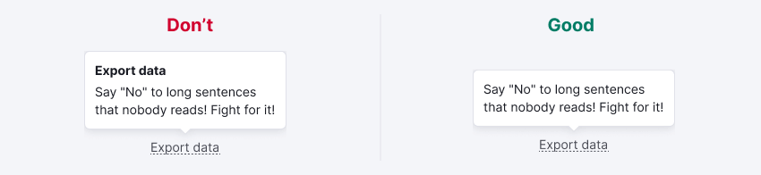

**When the trigger isn’t clear enough, add a clear title to the tooltip.** Additionally, include a title when the trigger doesn't adequately explain the topic of the tooltip. For example, you can describe additional conditions in the header or expand on the trigger's idea.

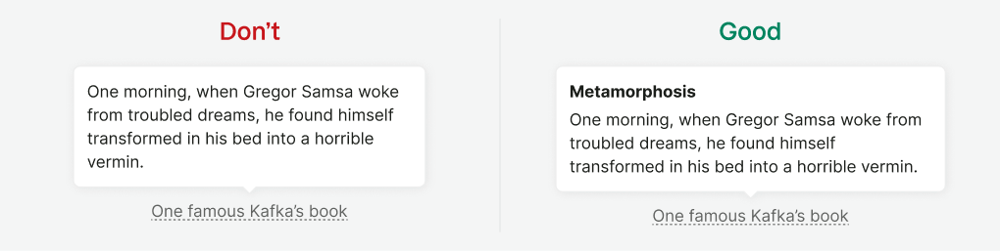

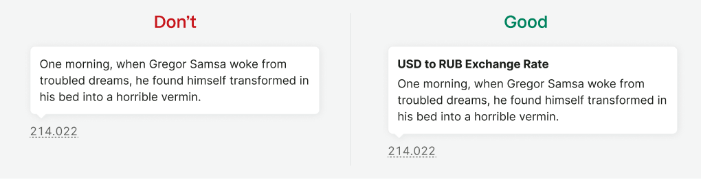

**Divide long text into paragraphs.**

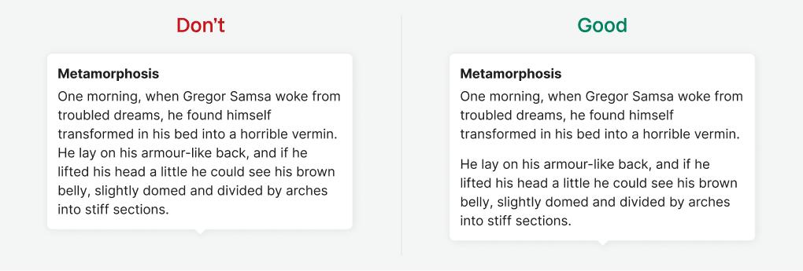

**Avoid overloading the tooltip with information.** A large amount of content can be inconvenient to view in the tooltip. If there is too much content and nothing can be removed, consider using a separate paragraph on the page or widget instead of a tooltip.

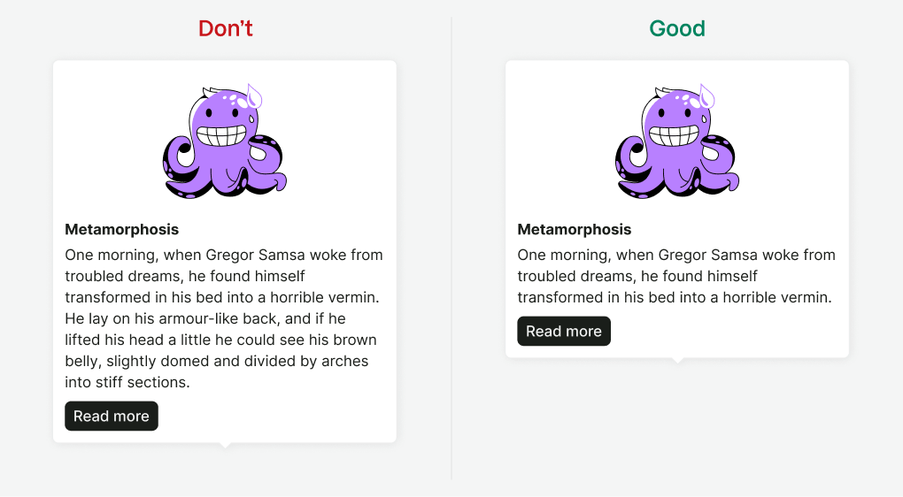

**Ensure that the tooltip doesn't prevent users from interacting with nearby triggers.**

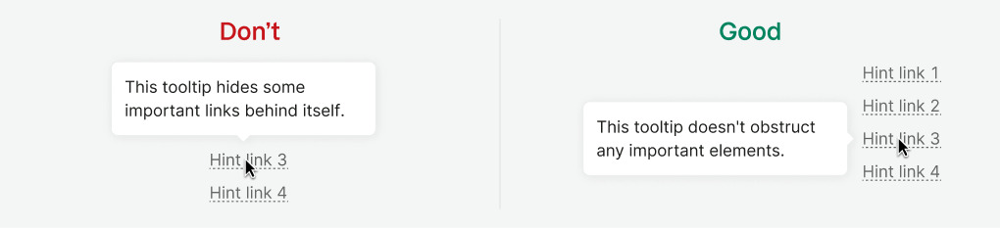
